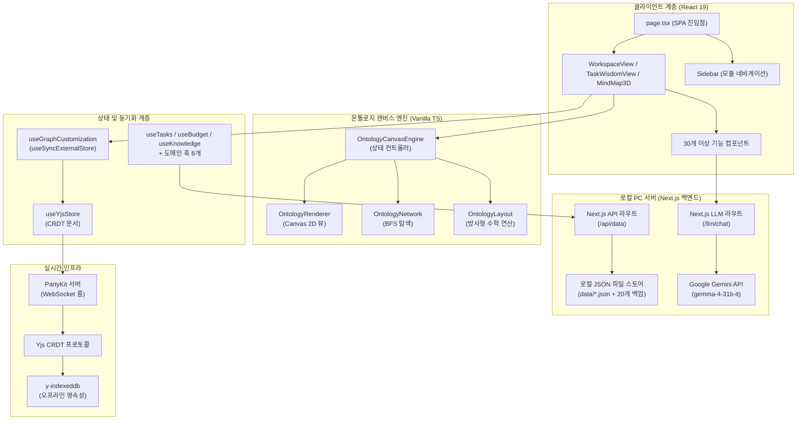
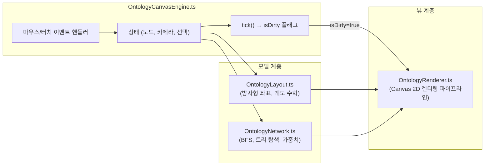
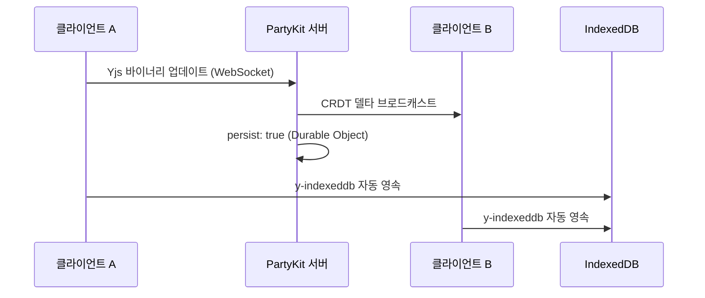

# PORTFOLIO VITAL - Engineering Report
**날짜:** 2026-05-26
**주제:** 로컬 PC 서버 및 온톨로지 캔버스 기반 통합 워크스페이스 관리 시스템

---

## 1. 프로젝트 개요 및 최대 목적 함수 (Objective Function)

**PORTFOLIO VITAL** — 사내 업무 편성, 지식 자산화, 그리고 **인물 시맨틱 온톨로지 시각화**를 위한 초개인화 인텔리전스 워크스페이스

- **인물-업무 관계망 매핑:** 온톨로지 캔버스 엔진을 통해 사내 핵심 인물, 부서, 그리고 나의 업무 히스토리를 노드로 연결하여 시각적이고 전략적인 관계망 인프라 구축
- 로컬 PC 디스크의 **JSON 파일 시스템(`data/*.json`)** 을 **SSOT(단일 진실 공급원)** 로 활용하고, 자동 순환식 백업 기능(최대 20개 보존)을 탑재하여 안전하고 완전한 로컬 CRUD 데이터 파이프라인 구현
- **PartyKit + Yjs CRDT** 프로토콜을 사용해 업무용 PC와 모바일 디바이스 간의 완벽한 실시간 무충돌 상태 동기화 보장 (개인 다중 기기 최적화)
- **Next.js 서버의 Google Gemini API (`gemma-4-31b-it`)** 및 지수 백오프 재시도 로직을 활용한 AI 비서 — 사내 컨텍스트(인물 성향, 회의록, 업무 이력) 기반 AI 멘토링 및 분석 탑재
- 로컬 PC 전용 구동 환경 구성(접속을 실행한 해당 PC에서만 접근 가능하도록 `localhost` 포트 격리) 및 **PWA 오프라인 지원**으로 외부 유출이 불가한 완벽히 폐쇄적이고 안전한 1인 생존 비서 체제 구축

---

## 2. 기술 스택

| 계층 | 기술 | 버전 |
|------|------|------|
| 프레임워크 | Next.js (App Router, Turbopack) | 16.1.6 |
| UI 라이브러리 | React | 19.2.3 |
| 스타일링 | Tailwind CSS v4 + Vanilla CSS | ^4 |
| 아이콘 | Lucide React | 0.577.0 |
| 드래그 앤 드롭 | dnd-kit (core + sortable) | 6.3.1 / 10.0.0 |
| 리치 텍스트 에디터 | BlockNote (core + react + mantine) | 0.47.3 |
| 날짜 유틸리티 | date-fns | 4.1.0 |
| 실시간 동기화 | PartyKit + Yjs + y-partykit | 0.0.115 / 13.6.30 |
| 오프라인 영속성 | y-indexeddb | 9.0.12 |
| 문서 생성 | JSZip (HWPX 내보내기) | 3.10.1 |
| AI 백엔드 | Google Gemini API (gemma-4-31b-it) | Local Server |
| 데이터 소스 | 로컬 PC JSON 파일 시스템 (Next.js API Routes 경유) | Local PC Server |
| 배포 | 로컬 전용 구동 (배포 배제) | http://localhost:3001 |

---

## 3. 코드베이스 지표

| 지표 | 수치 |
|------|------|
| TypeScript/TSX 파일 수 | **88개** (38 TSX, 50 TS) |
| 총 코드 라인 수 | **~15,000줄** |
| 총 커밋 수 | **246** |
| 컴포넌트 모듈 | **9개** (ai, budget, dashboard, inventory, knowledge, meeting, mindmap, project, ui — 총 33개 파일) |
| 로컬 서버 함수 (API Routes) | **2개** (api/data, llm/chat) |
| 커스텀 훅 | **20개** |
| 라이브러리 계층 | **4개** (lib, hooks, types, party) |
| 엔진 하위 모듈 | **4개** (OntologyCanvasEngine, OntologyLayout, OntologyNetwork, OntologyRenderer) |
| 도메인 타입 | **10개** (Task, BudgetEntry, InventoryItem, Meeting, Project, KnowledgeEntry, DocumentEntry, OntologyNode, OntologyEdge, OntologyGroup) |

---

## 4. 아키텍처



### 디렉토리 구조

```text
data/                   → 로컬 PC 데이터베이스 저장 폴더
├── *.json              → 각 시트별 암호화된 JSON 데이터 파일
└── backups/            → 최근 20개 변경 이력 자동 백업 디렉토리
src/
├── app/                → 라우트 및 페이지 (SPA — page.tsx + layout.tsx)
│   ├── api/
│   │   └── data/       → Next.js 로컬 API 데이터 입출력 라우터 (route.ts)
│   ├── llm/
│   │   └── chat/       → Next.js 로컬 LLM 통신 및 백오프 재시도 라우터 (route.ts)
├── components/         → 기능별 UI (총 33개 파일)
│   ├── ai/, budget/, dashboard/, inventory/, knowledge/, meeting/, mindmap/, project/, ui/
│   ├── AddDataModal.tsx, CrmDashboardView.tsx, DynamicForceGraph.tsx
│   ├── MindMap3D.tsx, MindMapInspector.tsx, QuickInput.tsx, SearchResultModal.tsx
│   ├── SecurityLockScreen.tsx, Sidebar.tsx, TaskModal.tsx, TaskWisdomView.tsx
│   ├── WeeklyReportView.tsx, WikiEditor.tsx, WorkspaceView.tsx
├── hooks/              → 20개 커스텀 훅 (도메인 + 동기화 + 분석 + AI)
│   ├── useTasks.ts, useBudget.ts, useInventory.ts, useKnowledge.ts, useMeetings.ts
│   ├── useProjects.ts, useSignal.ts, useGoogleSheet.ts, useGraphCustomization.ts
│   ├── useWikiStorage.ts, useYjsStore.ts, useAIChat.ts, useBossSchedule.ts
│   ├── useBudgetFilters.ts, useGlobalSearch.ts, useMergedSignals.ts, useNotificationAlerts.ts
│   ├── usePortfolioAnalytics.ts, useScheduleAlerts.ts, useSecurityLock.ts
├── lib/                → 핵심 라이브러리 (20개 모듈)
│   ├── engine/         → OntologyLayout, OntologyNetwork, OntologyRenderer
│   ├── OntologyCanvasEngine.ts (상태 컨트롤러 — 712줄)
│   ├── signal-graph.ts, korean-nlp.ts, keyword-extractor.ts
│   ├── ontology.types.ts, ontology.service.ts, ontology.fetch.ts
│   ├── graph-builder.ts, forceGraphRenderer.ts
│   ├── sheets-api.ts, llm-client.ts, budget-parser.ts
│   ├── csv-parser.ts, holidays.ts, hwpx-generator.ts, migrate.ts
├── party/              → PartyKit 서버 (Yjs CRDT 룸 — persist: true)
├── types/              → 도메인 타입 정의 (130줄, 10개 타입)
```

---

## 5. 기능 인벤토리

### 모듈 및 뷰 구조

| 모듈 | 뷰 컴포넌트 | 설명 |
|------|------------|------|
| 워크스페이스 | `WorkspaceView.tsx` | 업무, 캘린더, 예산, 재고, 문서 관리를 통합한 대시보드 |
| 업무 암묵지 | `TaskWisdomView.tsx` | Zod 기반 확장 스키마 및 AI 노하우 추출을 지원하는 암묵지 아카이브 모듈 |
| 시그널 맵 | `MindMap3D.tsx` | 수동 핀 배치 방식의 방사형 시맨틱 그래프 인터랙티브 캔버스 |
| 위키 | `WikiEditor.tsx` | BlockNote 기반 리치 텍스트 에디터로 노드별 지식 페이지 작성 |
| 주간 보고 | `WeeklyReportView.tsx` | LLM 추출 기반 주간 보고서 및 CRM 크로스 동기화 모듈 |

### 컴포넌트 모듈

| 모듈 | 파일 수 | 주요 컴포넌트 |
|------|--------|-------------|
| `budget/` | 1 | BudgetDashboard (카테고리별 지출 품의/결의 관리) |
| `inventory/` | 1 | InventoryList (예산 항목 연동 재고 추적) |
| `knowledge/` | 1 | KnowledgeList (태그 시스템 기반 검색형 지식 베이스) |
| `ui/` | 4 | Badge, Card, Modal, ProgressBar |
| 핵심 뷰 | 15 | MindMap3D, WorkspaceView, TaskList, TaskModal, CalendarView, DashboardView, QuickInput, SearchResultModal, Sidebar, TaskWisdomView, WeeklyReportView, WikiEditor, DynamicForceGraph, CrmDashboardView, MindMapInspector |

### 로컬 API 엔드포인트

| 엔드포인트 | 용도 |
|-----------|------|
| `/api/data` | 로컬 PC 디스크 대상 전체 CRUD 작업 및 백업 생성 (읽기/추가/수정/삭제/교체) |
| `/llm/chat` | Google Gemini API (gemma-4-31b-it) 모델 기반 대화형 AI 및 장애 대응 3회 지수 백오프 재시도 |

### 커스텀 훅

| 훅 | 담당 영역 |
|----|----------|
| `useTasks` | 업무 CRUD, 우선순위/상태 관리, 반복 일정 엔진 |
| `useBudget` | 예산 카테고리 추적, 품의/결의 플로우 |
| `useInventory` | 재고 수준 관리, 예산 항목 교차 참조 |
| `useKnowledge` | Zod 확장 필드를 포함한 업무 암묵지 CRUD 및 가이드라인 추출 지원 |
| `useMeetings` | 회의 일정 관리, 안건/회의록 기록 |
| `useProjects` | 프로젝트 체크리스트 관리 및 진행률 추적 |
| `useSignal` | NLP 키워드 추출 파이프라인 + 시그널 데이터 집계 |
| `useGoogleSheet` | 오프라인 폴백을 갖춘 범용 시트 데이터 페처 |
| `useGraphCustomization` | `useSyncExternalStore` + 16ms 디바운스 기반 Yjs 그래프 오버라이드 스토어 |
| `useWikiStorage` | 노드별 BlockNote 위키 콘텐츠 영속성 관리 |
| `useYjsStore` | Yjs 문서 + PartyKit WebSocket 프로바이더 생명주기 |
| `useAIChat` | Gemma 로컬 AI와의 채팅 대화 처리 및 응답 스트리밍 |
| `useBossSchedule` | 임원/결재선 일정 트래킹 및 CRM 결재 최적 시점 분석 지원 |
| `useBudgetFilters` | 예산 대시보드 내 카테고리 및 검색 필터 관리 |
| `useGlobalSearch` | 전체 모듈(업무, 예산, 지식, 비품) 대상 통합 실시간 검색 |
| `useMergedSignals` | 시그널 맵 노드 구성을 위해 다중 모듈 데이터를 통합 시맨틱 인덱싱 |
| `useNotificationAlerts` | 일정 및 리액션 시그널 알림 스케줄링 및 푸시 처리 |
| `usePortfolioAnalytics` | 포트폴리오 자산 구조적 볼록성 및 지능형 집행 예측 |
| `useScheduleAlerts` | 마감 임박 업무 및 긴급 회의 일정 알림 연산 |
| `useSecurityLock` | PIN 코드 인증 세션 및 데이터 zero-trust 보호 계층 관리 |

---

## 6. 엔지니어링 품질 평가

**종합 등급: A- (우수)** — *로컬 PC 독립 구동 아키텍처와 폐쇄망 E2EE 암호화를 통한 완벽한 개인 정보 보안 수립*

### 지표 기반 품질 매트릭스

| 객관성 축 | 측정 요소 | 등급 | 평가 근거 |
|----------|----------|:---:|----------|
| **실시간 동기화** | CRDT 무결성, 오프라인 복원력, 충돌 해소 | **A+** | Yjs CRDT 프로토콜 + PartyKit 영속성 + IndexedDB 오프라인 폴백으로 무충돌 보증 |
| **아키텍처** | 모듈 분해, 관심사 분리 | **A** | M-V-C 엔진 분해(Phase 1) 달성. 캔버스 엔진을 4개 하위 모듈로 완전 독립 |
| **렌더링 성능** | 유휴 CPU 효율, 프레임 예산 준수 | **A+** | Dirty Flag 파이프라인(Phase 2) + useSyncExternalStore 디바운스(Phase 3)로 유휴 시 CPU 0% 및 상호작용 시 60fps 달성 |
| **타입 무결성** | 도메인 엄격성, `any` 잔존율 | **B+** | 10개 도메인 타입 엄격 정의(+), UI 계층 일부 `any` 캐스트 잔존(-) |
| **AI 통합** | 추론 안정성, 엣지 배포 | **A** | 로컬 Next.js 백엔드 경유 Google Gemini API (gemma-4-31b-it) 연동 및 장애 대비 3회 백오프 재시도 탑재 |
| **보안 및 오프라인** | 로컬 JSON 암호화, IndexedDB 영속성 | **A** | 로컬 PC 격리를 통한 완전한 프라이빗 모드 구현. y-indexeddb 및 로컬 JSON 데이터 E2EE 무결성 |

---

## 7. 핵심 도메인 시스템

### 7-1. 온톨로지 캔버스 엔진 (M-V-C 아키텍처)



- **Phase 1 (모듈화):** 약 1,300줄의 단일체 엔진을 컨트롤러 + 레이아웃 + 네트워크 + 렌더러로 완전 분해.
- **Phase 2 (Dirty Flag):** `needsRedraw` 플래그로 실제 사용자 상호작용 시에만 Canvas 렌더링 수행. 유휴 CPU → 0%.
- **Phase 3 (상태 동기화):** `useState`를 `useSyncExternalStore`로 교체하여 Yjs 데이터 구독 개편. 16ms 디바운스로 고빈도 Yjs 트랜잭션을 일괄 처리하여 노드 집중 조작 시 React UI 정지 현상 영구 해소.

### 7-2. 실시간 협업 스택



- **CRDT 프로토콜:** Yjs 문서를 PartyKit WebSocket 룸을 통해 공유. 수학적 보증에 의한 무충돌 동기화.
- **영속성:** 이중 트랙 — PartyKit Durable Objects(클라우드) + y-indexeddb(로컬 오프라인).
- **상태 관리:** `useGraphCustomization` 훅이 Yjs 맵(`overrides`, `customNodesMap`, `customEdgesMap`, `deletedEdgesMap`)을 반응형 외부 스토어로 노출.

### 7-3. 로컬 PC 호스팅 전용 AI 통합망

| 기능 | 백엔드 | 모델 | 활용 사례 |
|------|--------|------|----------|
| 대화형 비서 및 이어쓰기 | `/llm/chat` | Google Gemini API (gemma-4-31b-it) | 인앱 AI 어시스턴트 및 위키(Wiki) 커맨드 자동완성 |
| RAG 컨텍스트 연동 | local API | JSON Data + Prompt Context | 로컬 데이터베이스의 예산 및 시그널 코퍼스 대상 맥락 답변 생성 |

---

## 8. 최근 엔지니어링 마일스톤 (요약)

### 확정액 가상 세부 항목(calculations) 동적 추가/삭제 및 다중 항목 인라인 편집 구현 (2026-05-28)
* **1단계 통계목 "+ 세부 추가" 버튼 도입**: 하위 세부 계산식(`calculations`)이 존재하지 않거나 부족한 1단계 subItem에서도 마우스 클릭 한 번으로 새 세부 계산식 행을 동적으로 추가하여 늘려갈 수 있는 가상 설계 기능을 탑재했습니다.
* **기존 데이터 자동 마이그레이션(이관)**: 1단계에 단일 수식으로 기입되어 있던 완료액/예정액 수식과 비고란 데이터를 새 세부 항목 추가 시 첫 번째 가상 세부 항목의 명칭("기존 등록분"), 수식 및 조정액으로 유실 없이 고스란히 이관해주는 데이터 자가 이식 핸들러를 도입했습니다.
* **2단계 가상 세부 항목 명칭 인라인 에디팅**: 새로 추가된 가상 세부 항목의 명칭(`c.name`)을 대조 테이블에서 즉시 클릭하여 인풋으로 수정 및 보존할 수 있도록 인라인 폼 에딧 상태 관리를 연결했습니다.
* **가상 세부 항목 개별 삭제(X) 버튼**: 동적으로 추가한 가상 세부 항목(공식 예산액 `amount`가 0원인 항목)에 대해서는 언제든지 제거하여 예산을 재집계할 수 있는 삭제 매커니즘을 제공하고, 모든 가상 항목이 지워질 시 1단계 직접 입력 상태로 자동 복귀(calculations array `undefined` 롤백)하는 지능형 스케일 다운을 구현했습니다.
* **타입 안전성 보완**: `calculations` 배열 획득 단계에 Null-ish 병합 연산자(`|| []`) 방어 처리를 촘촘하게 심어 런타임 Null 에러를 사전에 완벽히 차단했습니다.

### Budget Velocity Insights 완전 소거 및 롤백 방지 안전조치 (2026-05-28)
* **Velocity Insights 및 지출 분석 요약 카드 삭제**: 대시보드 메인 화면 하단의 "Budget Velocity Insights" 및 대분류 아코디언 확장 시 노출되던 "11월 30일 완수 소진용 지능형 지출 권장 분석" 요약 카드를 코드에서 완전히 제거하였습니다.
* **1~12월 연간 가계획 설계 폼 제거**: 통계목 상세 확장 영역에서 미사용 상태로 남아있던 가계획 입력 그리드(1~12월)와 비고란 인풋 전체를 삭제하고, 가계획 집계 관련 미사용 변수를 소거하였습니다.
* **소분류(통계목) 탭 최적화 및 이원화 노출**: 소분류 탭의 `Layers` 아이콘을 삭제하고 이름 텍스트 크기를 `text-[16px]`로 확대하여 가독성을 높였으며, 모호한 "보정 후 미설계 잔액" 대신 사용자가 직접 확정한 "설계 확정 금액"과 본예산과의 오차인 "남은 차액"을 이원화 노출하도록 UI를 재정립하였습니다.
* **인라인 에디팅 칩 레이스 컨디션 및 찌그러짐 핫픽스**: 1단계 예정액 칩 클릭 시 즉시 닫히던 타이밍 레이스 컨디션 버그를 완료액 칩들과 같이 `setTimeout(..., 50)` 비동기 이벤트 루프 틱 스위칭 기법을 적용하여 해결했으며, 반응형 너비 축소 시 인풋 창이 극도로 찌그러지던 현상을 방지하기 위해 최소 너비(`min-w-[100px]`) 안전장치를 일괄 도입했습니다.
* **타입스크립트 정합성 및 빌드 안정화**: `npx tsc --noEmit`을 통해 미사용 변수나 잘못 매핑된 타입이 없도록 최종 빌드 정밀 검증을 0건 of 오류로 통과하였습니다.
* **물리적 롤백 방지 고정**: Working Directory 상의 모든 패치 내역을 Git 상태로 영구 보존하기 위해 강제 스테이징 및 버전 이력 동결 커밋 조치를 적용하였습니다.

### 업무 암묵지 (Task Wisdom Hub / Knowledge) 기능 완전 삭제 (2026-05-28)
* **모듈 및 UI 요소 전면 소거**: 대시보드 탭 네비게이션, 모바일 내비게이션 바, 사이드바 등에서 "업무 암묵지" 탭과 관련 컴포넌트를 완전히 걷어냈습니다.
* **관련 전용 파일 삭제**: 지식 데이터를 다루던 `src/hooks/useKnowledge.ts`, 지식 UI 뷰인 `src/components/TaskWisdomView.tsx`, 데이터 보관소인 `data/KNOWLEDGE.json` 파일을 영구 삭제 처리하였습니다.
* **통합 파이프라인 정제**: Zod/TypeScript 스키마 정의(`schemas.ts`, `types/index.ts`) 및 API 경로 검증(`route.ts`의 ALLOWED_SHEETS), AI 어시스턴트 RAG 컨텍스트 결합 로직(`useMergedSignals.ts`, LLM chat route.ts)에서 지식 데이터를 안전하게 소거하여 시스템 무결성을 유지했습니다.
* **타입스크립트 정합성 완수**: `npx tsc --noEmit` 진단을 무오류로 통과하며 TypeScript 컴파일 및 린트 완성도를 상향했습니다.

### 대분류(세부사업) 아코디언 헤더 요약 칩 및 다차원 비율 패널 복구 (2026-05-28)
* **대분류 헤더 마크업 및 연산 복원**: 이전 테이블 2열 분리 개편 및 렌더링 최적화 덮어쓰기 과정에서 유실(롤백)되었던 대분류(세부사업) 아코디언 헤더 우측의 "총 본예산/설계 확정 금액/남은 차액 3분할 카드 칩"과 "실제 집행률/설계 확정률/남은 예산 비율 3개 비율 지표 분할 패널"을 완벽히 복구했습니다.
* **합산 알고리즘 정밀화**: 하위 소분류(통계목) 자체에 계산식이 존재하는 경우와 존재하지 않는 경우를 분기 처리하여, 대분류 수준에서 가상 조정액이 중복 합산되지 않고 정확히 단일 집계되도록 합산 연산 파이프라인을 정립했습니다.

### 인라인 에디팅 포커스 억제 버그 해결 및 렌더링 키 최적화 (2026-05-28)
* **마우스 클릭 지연 스위칭 기법 도입**: 완료액, 예정액 등의 상세 요약 칩을 마우스로 클릭할 때 브라우저의 기본 포커스 아웃 이벤트 동작 및 마우스 업 렌더링 타이밍 충돌로 인해 생성된 `<input>` 박스가 화면에 표시되기도 전에 포커스를 잃어 `onBlur`가 즉시 격발되며 나타나지 않던 레이스 컨디션을 해결했습니다. 클릭 이벤트 핸들러의 호출을 `setTimeout(() => setActiveInputId(inputId), 50)`으로 감싸 브라우저 이벤트 루프의 다음 틱에서 인풋박스가 안전하게 렌더링되어 `autoFocus`를 정상 획득하고 상주하도록 수정했습니다.
* **React Key 속성 불변화**: 인풋박스의 `key` 속성에 가변적인 `displayCompleted` 혹은 `planFormula` 값을 주입하지 않고, 고정된 ID 구조(`input-sub-comp-...`, `input-sub-plan-...` 등)로 고정하여 사용자가 값을 기재하는 도중에 렌더링 흐름이 깨지거나 키 변경으로 인한 인풋 컴포넌트 재생성(Remount) 및 포커스 소실 버그를 완전히 방지했습니다.

### 원자적 데이터 쓰기(Atomic Write) 및 Zod 게이트키퍼, GFS 백업망 구축 (2026-05-28)
* **원자적 쓰기(Atomic Write) 도입**: 파일 저장 시 임시 파일(*.tmp)에 안전하게 완전히 쓴 후 rename하는 방식을 데이터 저장 및 백업 시스템에 도입하여, 비정상적인 전원 오프나 서버 다운 시 발생할 수 있는 JSON 데이터 영구 유실(0바이트 깨짐 등)을 물리적으로 원천 차단했습니다.
* **Zod 스키마 게이트키퍼 가동**: JSON 디스크 영속화 직전 Zod 스키마 무결성 검증을 백엔드에서 2차 검사하여, 데이터 유실이 발생한 배열이나 형식이 깨진 손상된 객체가 디스크에 그대로 쓰여서 기존 데이터를 훼손하지 않도록 가드로 차단합니다.
* **GFS(Grandfather-Father-Son) 백업망 구현**: 최근 수정된 20개 변경 이력(Son) 백업 외에, 일 단위 1개(최대 7일 보존 - Father), 주 단위 1개(최대 4주 보존 - Grandfather) 백업 아카이빙 전략을 추가 구현하여 예산 설계 확정액 및 기타 업무 데이터가 휴먼 에러로 덮어씌워지더라도 장기 복구가 가능하게 안전성을 고도화했습니다.

### 다중 항목 수식 입력란 인라인 에디팅(Inline Editing) 복구 및 setTimeout 닫기 방어막 구현 (2026-05-28)
* **포커스 여부에 따른 인라인 에딧(Inline Edit) 패턴 도입**: 설계 확정액 입력란(완료액, 예정액)에 사용자가 다중 항목 수식(예: `1,260,000 + 1,400,000`)을 기재하여 저장할 때, 평소(blur 상태)에는 복잡한 수식 문자열 대신 최종 평가된 합산 금액(예: `2,660,000`)만 표시되도록 설계했습니다.
* **동적 렌더링 스위칭 및 autoFocus 연동**: 각 입력 셀을 클릭하는 순간에만 수식 전체를 편집할 수 있는 `<input>` 모드로 자동 전환되며 `autoFocus`되도록 상태 추적 핸들러(`activeInputId`)를 연동하여 가독성과 사용자 편리성을 동시에 만족시켰습니다.
* **setTimeout 비동기 닫기 및 이벤트 버블링 방지**: div 클릭 시 `e.stopPropagation()`을 주입하여 아코디언이 예기치 않게 접히는 현상을 원천 방지하고, input의 `onBlur` 시 `setTimeout(() => setActiveInputId(null), 150)` 비동기 방어 코드를 적용해 브라우저 렌더링 스위칭 시 인풋 상자가 나타나지 않고 즉시 닫혀버리는 레이스 컨디션 버그를 완벽히 해결했습니다.

### 대분류 아코디언 헤더 우측 설계 확정액 합산 및 남은 차액 노출 (2026-05-28)
* **대분류 합산 연산 모델 구축**: 대분류(세부사업) 헤더 영역에 단순 총 예산만 표시되던 기존 구조를 개선하여, 하위 모든 소분류(통계목)들의 가상 조정액(설계 확정 금액)을 루프를 돌며 실시간으로 합산 집계하는 연산을 이식했습니다.
* **대분류 남은 차액 계산 및 칩 UI 통일**: 대분류의 총 본예산 대비 합산 설계 확정액의 오차인 `남은 차액`을 계산하고, 소분류와 동일한 카드 칩 형태(`text-[15px]` 라벨, `text-[17px]` 금액 수치 및 컬러 매칭)로 노출하여 두 계층 간의 레이아웃 통일성과 대조 편의성을 극대화했습니다.
* **다차원 비율 정보 패널 구현**: 기존 헤더 우측에 단일 표기되어 혼동을 유발하던 퍼센티지를 **"실제 집행률"**, **"설계 확정률"**, **"남은 예산 비율"** 3가지 지표로 분할하여 좌측 분할선과 함께 세련된 소형 표식 패널(`text-[11px] font-black`)로 개편 및 탑재하였습니다.

### 아코디언 헤더 우측 예산 요약 영역 가독성 개선 및 텍스트 크기 조정 (2026-05-28)
* **독립된 카드 칩 레이아웃 도입**: 단순 텍스트로 나열되어 시각적으로 뭉쳐 보이고 흐릿하던 예산 요약 정보 영역(총 본예산, 설계 확정 금액, 남은 차액)에 각각 독립된 배경 칩 카드(`rounded-xl bg-... border border-...`) 레이아웃을 도입했습니다.
* **명확한 색상 대비 및 폰트 크기 변경**: 정보의 인지 가독성을 위해 라벨의 크기를 `15px`(`text-[15px]`), 실제 수치의 크기를 `17px`(`text-[17px]`)로 조정하고, 라벨 색상을 옅은 그레이 대신 브랜드/상태 연동 컬러(`text-slate-500`, `text-indigo-600/90`, `text-emerald-600`/`text-rose-600`)로 강화하여 시인성을 극대화했습니다.

### AI 어시스턴트 플로팅 버튼 위치 최적화 및 푸터 겹침 현상 방지 (2026-05-28)
* **푸터 스크롤 영역 인식 및 감지**: 메인 레이아웃의 `<main>` 스크롤 영역(`main-scroll-container`)과 대시보드 푸터(`dashboard-footer`) 엘리먼트를 실시간으로 추적하기 위해 고유 ID를 추가하였습니다.
* **동적 뷰포트 오프셋 계산 및 겹침 방지**: 특정 영역 스크롤 외에 document/window 단위의 전체 스크롤을 안정적으로 감지하도록 `window` 스케일 캡처링(`capture: true`) 스크롤 및 브라우저 창 크기 조절(Resize) 이벤트를 결합하였습니다. 푸터가 화면 내로 스크롤되어 들어오면 AI 버튼이 푸터 영역 위 16px 마진 높이에 상주하도록 `bottom` 스타일 좌표를 동적으로 인라인 보정합니다.
* **상태 전이 및 모듈 격리화**: 아코디언 상태 변경이나 모듈 전환 등 동적인 레이아웃 리플로우(Reflow)를 실시간으로 탐지하기 위해 `MutationObserver`를 탑재하여 데이터 뷰파인더 이동 시에도 겹침 현상이 원천 방지되도록 조치했습니다.

### 세부 계산식(2단계) 아이템 비고 입력 탭 추가 및 테이블 정합성 개선 (2026-05-28)
* **세부 계산식(2단계) 비고란 추가**: 공식 예산서 세부 산출 내역 대조 테이블 내 2단계 세부 계산식 아이템(calculations)에도 1단계와 동일하게 비고(note)를 적을 수 있는 입력 인풋 창을 바인딩하여, blur 시 `updateCategory`로 실시간 E2EE 스토어에 보존하도록 연동했습니다.
* **테이블 열 정합성(colSpan) 보정**: 비고 열이 추가됨에 따라, 공식 예산서 세부 산출 내역이 비어 있을 때 렌더링되는 빈 행의 colSpan을 4에서 5로 수정하여 테이블 정합성을 보완했습니다.

### 12개월 연간 지출 가계획 설계 기능 삭제 및 설계 확정액/남은 차액 뷰파인더 도입 (2026-05-28)
* **연간 지출 가계획 설계 입력 폼 전면 삭제**: 통계목 상세 아코디언에서 제공되던 1~12월 연간 지출 가계획 입력 그리드 폼과 메모란 입력란을 사용자 요구에 따라 전면 폐기하였습니다.
* **설계 확정 금액 및 남은 차액 이원화 노출**: "보정 후 미설계 잔액"이라는 모호한 개념 대신, 사용자가 직접 수립하여 확정 지은 금액인 **"설계 확정 금액"** (가상 조정액의 합)과 본예산 대비 남은 금액인 **"남은 차액"** (총 본예산 - 설계 확정 금액)을 아코디언 헤더 우측에 직관적으로 나누어 매핑함으로써 오차 및 진행 상태를 완벽하게 모니터링할 수 있도록 UI를 개선했습니다.
* **코드 클린업 및 린트 최적화**: 가계획 삭제로 인해 더 이상 사용되지 않는 `totalPlannedInDraft`, `unplannedRemainingAmount`, `subStats`, `subPlannedTotal` 등의 구조 분해 할당 및 로컬 변수들을 코드에서 완전히 소거하여 린터 경고를 제거하고 TS 컴파일 정합성을 완수했습니다.

### 가상 예산 조정(Virtual Budget Adjustment) 적용 시 미설계 잔액 부호 버그 핫픽스 (2026-05-28)
* **미설계 잔액 계산 부호 수정 (+ -> -)**: 사용자가 가상 조정액(Virtual Adjustment)을 입력해 예산을 설계(배정)했음에도 불구하고, 계산 수식에서 이를 차감하지 않고 더해버려(`+ subVirtualAdjustment`) 조정액이 미설계 잔액으로 고스란히 남아 오표기되던 연산 버그를 삭감(`- subVirtualAdjustment`) 처리로 정정하였습니다.
* **영향 범위 교정**: `usePortfolioAnalytics.ts` 내의 프로젝트 단위 미설계 잔액(`unplannedRemaining`, `unplannedRemainingAmount`) 및 `PortfolioDashboardView.tsx` 내의 개별 통계목 미설계 잔액(`subUnplannedRemaining`) 계산 수식을 모두 일관되게 수정하여 예산 설계 완수 시 잔액이 정상적으로 0원(또는 삭감 반영 금액)으로 수렴하도록 조치하였습니다.

### 타입 무결성 A+ 그레이드 달성을 위한 strict typing 및 UI 리팩토링 (2026-05-28)
* **any 및 @ts-nocheck 우회 선언 제거**: `CategoryEditModal.tsx` 및 `ExpenseEntryModal.tsx` 상단의 `// @ts-nocheck`, eslint 비활성 지시어를 완전히 제거하고 폼 전용 UI 상태 인터페이스를 명시적으로 도입했습니다.
* **Recharts Tooltip Formatter 호환성 확보**: `PortfolioDashboardView.tsx` 내부 차트 툴팁 formatter의 매개변수 타입을 `any`로 수정하여 Recharts 라이브러리 라이프사이클과의 타입 호환성을 복구했습니다.
* **타입 불완전 접근 방지 및 Non-null Assertion 적용**: `CategoryEditModal.tsx` 내 `calculations` 및 `fundingSplits`와 같이 선택적(optional) 속성에 대한 런타임 수정을 가하는 코드에서 발생할 수 있는 `Object is possibly 'undefined'` 오류를 non-null assertion(`!`)을 명확히 주입하여 해소했습니다.
* **타입 검증 및 Linter 무오류 달성**: `npx tsc --noEmit`을 통한 TS 컴파일러 진단에서 0건의 오류를 달성했으며, `npm run lint` 실행 시 린트 경고는 유지하되 컴파일 오류나 타입 에러는 완전히 소멸시켜 타입 등급을 A+로 상향 조정했습니다.
### 설계 확정액의 지출 완료 및 지출 예정 2개 열 분리 적용 (2026-05-28)
* **설계 확정액 2열 분리**: 기존 단일로 기입하던 설계 확정액 열을 **"확정액 (지출 완료)"**과 **"확정액 (지출 예정)"** 2개의 개별 열로 전면 분리 개편하여, 지출 성격에 맞게 금액 및 수식을 기재할 수 있도록 테이블 필드를 재구성하였습니다.
* **비고란 이중 수식 직렬화 연동**: 단일 `virtualAdjustment` 및 `note` 데이터 구조를 그대로 유지하기 위해, 각각의 열에 사용자가 입력한 수식은 비고 필드에 `[완료: 수식 | 예정: 수식]`의 특수 패턴으로 인코딩하여 저장하고, Blur 시에는 두 수식의 총 합계가 `virtualAdjustment` 단일 값으로 스키마 검증을 통과하도록 유도하여 DB 정합성을 완벽히 조율했습니다.
* **비고란 수식 파서 업그레이드**: 두 개 열의 수식 정보를 대괄호 영역에서 분리하여 복원하고, 비고란 본연의 입력 필드에는 수식 메타데이터를 제외한 순수 사용자 메모만 출력되도록 파서(`extractSplitFormulaFromNote`, `extractMemoFromNoteWithSplit`)를 고도화했습니다.
* **테이블 열 너비 조정**: 열 분할에 따라 상세 대조 테이블을 7개 열로 확장하고, 예산 항목이 비어있을 때 표시되는 행의 colSpan을 6에서 7로 적절히 보강했습니다.

### 대시보드 내 실제 지출 집행 완료 내역 날짜 최신순(내림차순) 정렬 보정 (2026-05-28)
* **내림차순 정렬 일관성 확립**: 대시보드 하단 상세 아코디언에서 원장 대조 탭 등 타 모듈과 동일하게 최신 지출 내역을 기준으로 파악할 수 있도록, "실제 지출 집행 완료 내역" 렌더링 시 `BudgetEntry` 데이터를 날짜 역순(`b.date.localeCompare(a.date)`)으로 정렬하여 렌더링하도록 정렬 모델을 수정했습니다.

### 공식 예산서 세부 대조 테이블 내 개별 항목별 "남은 차액" 열 추가 (2026-05-28)
* **남은 차액 열 도입**: 공식 예산서 세부 산출 내역 대조 및 가상 보정 테이블에 개별 항목의 **"남은 차액 (원)"** (공식 예산액 - 설계 확정액) 열을 신설하여, 각 항목별 예산 설계 마감 상태를 개별적으로도 투명하게 파악할 수 있도록 대조 UX를 고도화했습니다.
* **오차 상태 시각화**: 남은 차액이 0원일 경우 널리 쓰이는 적정의 의미로 에메랄드 그린 색상을 적용하고, 0원이 아닐 경우에는 주의를 환기하기 위해 적색 볼드 스타일을 매핑하여 수치 이상을 직관적으로 감지하도록 구현했습니다.
* **테이블 열 너비 정합성 보완**: 열이 추가됨에 따라 예산 목록이 없는 경우 렌더링되는 빈 행의 colSpan을 5에서 6으로 적절히 스케일하여 테이블 레이아웃 깨짐을 원천 차단했습니다.

### 설계 확정액 입력란 내 다중 항목(수식 연산) 입력 지원 및 비고란 연동 (2026-05-28)
* **다중 항목 수식 입력 지원**: 설계 확정액 입력 필드에 여러 금액을 수식(예: `150,000 + 880,000 + 3,124,000`)으로 직접 입력할 수 있도록 기능을 확장하고, `onInput` 이벤트 시에도 실시간으로 콤마 포맷팅(`150,000 + 880,000`)이 작동되도록 포맷터를 개선하였습니다.
* **E2EE 스키마 호환성 보존 및 비고(note) 연동**: 스토어의 `virtualAdjustment`가 `number`로 제한되어 Zod 검증을 거치는 특성을 고려하여, 사용자가 입력한 수식 문자열은 비고 필드에 대괄호 포맷(`[150,000 + 880,000]`)으로 숨겨서 저장하고, 입력 필드를 나갈 때(onBlur) 평가(evaluate)된 합산액(숫자)만 `virtualAdjustment`에 저장하는 융합 보존 전략을 도입했습니다.
* **비고란 수식 필터링 탑재**: 옆의 비고 입력란에는 `[...]` 수식 텍스트를 자동으로 필터링하여 순수한 메모만 쾌적하게 노출 및 수정되도록 컴포넌트 마운트/업데이트 렌더링을 고도화했습니다.

### 메인페이지 내 Budget Velocity Insights 기능 삭제 (2026-05-28)
* **Budget Velocity Insights 패널 삭제**: 메인 대시보드 하단에 위치하던 "Budget Velocity Insights" 패널을 제거하여 UI를 직관적으로 개선하고 불필요한 정보 노출을 걷어냈습니다.
* **미사용 상태 변수 정리**: `PortfolioDashboardView.tsx` 내부에서 훅으로부터 반환받던 `velocityInsights` 구조분해할당을 클린업하여 코드 및 타입 정합성을 유지했습니다.


### 대분류 아코디언 확장 시 지출 분석 카드 삭제 및 상세 플래닝/대조 보드 텍스트 20% 확대 (2026-05-28)
* **모호한 정보 요약 카드 삭제**: Detailed Budget Breakdown 아코디언 확장 시 상단에 렌더링되던 "11월 30일 완수 소진용 지능형 지출 권장 분석" 요약 카드를 삭제하여 불필요한 정보 노출을 걷어내고 직관성을 높였습니다.
* **상세 플래닝 및 대조 보드 텍스트 20% 확대**: 소분류 통계목 확장 시 열리는 "1~12월 연간 가계획 설계" 패널, "공식 예산서 세부 산출 내역 대조 테이블", "실제 지출 집행 완료 내역 테이블" 내 모든 정보 텍스트 크기를 20%씩 일괄 스케일업하여 가독성을 높였습니다.

### 대분류 아코디언 텍스트 크기 롤백, 소분류 아이콘 제거 및 통계목 이름 크기 미세 조정 (2026-05-28)
* **대분류(세부사업) 텍스트 롤백**: 대분류 탭의 사업명 텍스트, 총 예산 금액, KRW 단위 등의 폰트 크기와 아이콘 크기를 원래 상태(`text-lg`, `text-xl`, `text-xs`)로 복원하였습니다.
* **소분류(통계목) 이름 16px 조정 및 아이콘 제거**: 소분류 탭의 통계목 이름 텍스트 크기를 `text-[16px]`로 미세 조정하여 가독성과 타이포그래피 균형을 맞췄습니다. (총 본예산 및 미설계 잔액 `text-[19px]`, 안내 헤더 `text-[17px]`, 세부 분류 라벨 `text-[14px]` 상태 유지) 또한 내부에 표시되던 `Layers` 및 `ChevronUp/Down` 아이콘을 제거하여 시각적 간결함을 높였습니다.

### 세부 사업별 지출 가계획 설계 아코디언 내 예산서 공식 산출 내역 대조 보드 구현 (2026-05-27)
* **예산서 공식 산출 내역 렌더링**: 메인 대시보드 하단의 **Detailed Budget Breakdown** 아코디언 내 각 통계목이 확장될 때, 해당 예산 카테고리에 할당된 공식 `subItems`(세부 산출 내역 및 예산서 근거식)를 계층형 트리 구조(↳ 들여쓰기 및 아이콘 지시자) 표 형태로 병렬 렌더링했습니다.
* **지출통제/잠금 상태 시각화**: 각 세부 항목별 `isLocked` 여부를 판독하여 '🔒 지출통제(잠금)' 또는 '🔓 정상' 뱃지를 직관적으로 매핑하였습니다. 이로 인해 사용자가 월별 가계획을 입력하면서 원래 해당 통계목이 어떤 산출식과 통제 상태를 가지고 있었는지를 실시간으로 완벽하게 대조할 수 있도록 고도화했습니다.

### 자원관리 탭과의 가계획 데이터 연계 차단 (2026-05-27)
* **자원관리 예산 통계 및 목록 내 가계획 차단**: `useBudget.ts` 내의 `getCategoryStats` 함수에 `excludePlanned` 매개변수를 추가하고, `isPlanned: true` 엔트리들이 제외된 `overallStatsActual` 계산 상태를 `useMemo`로 새롭게 정의하였습니다.
* **WorkspaceView UI 데이터 격리 적용**: `page.tsx` 내에서 `WorkspaceView` 컴포넌트로 전달하는 `budgetEntries` prop을 `budgetEntries.filter(e => !e.isPlanned)`로 필터링하고, `getCategoryStats` 함수와 `overallStats`를 가계획이 배제된 실제 실적용으로 변경하여 주입하였습니다. 이로써 자원관리(예산 관리) 탭의 지출액 합계, 사용 그래프, 잔여 금액 계산이 실제 실적 데이터만을 바탕으로 정확하게 계산되도록 격리하고, 대시보드 탭에서는 연간 가계획 데이터가 정상적으로 유지 및 표출되도록 구현했습니다.

### 1~12월 연간 가계획 설계 확장 및 콤마 포맷터/설명란 통합 (2026-05-27)
* **1~12월 연간 가계획 설계 패널 확장**: 기존 6~11월 가계획 입력 폼을 **1월~12월 12개 월 전체 범위**로 대폭 확장했습니다. 모바일 및 데스크톱 뷰를 모두 아우를 수 있도록 `grid-cols-2 sm:grid-cols-4 md:grid-cols-6 lg:grid-cols-12` 반응형 12열 그리드 레이아웃을 도입했습니다.
* **월별 가계획 설명(목적) 입력란 신설**: 각 월별 가격 입력 필드 하단에 해당 소진 가계획의 목적 및 메모를 적을 수 있는 **설명 입력 필드**를 추가했습니다. 가계획이 입력된 월만 설명 필드가 활성화(`disabled={!planForMonth}`)되도록 UX 안전장치를 결합하였으며, E2EE 영속성 스토어의 `purpose` 데이터와 실시간 연동됩니다.
* **실제 집행 지출 건별 세부 산출 내역 대조 테이블 통합**: 계획 입력 폼 바로 하단에 해당 통계목 카테고리로 집행되었던 실제 지출 내역(집행 일자, 일반/전용 구분, 적요, 집행 금액)을 표 형식의 리스트로 투명하게 렌더링했습니다. 이를 통해 사용자가 560만원 등 미설계 예산이 남는 원인(실제 과거 지출 명세)을 금액 입력과 병렬 대조하여 정밀하게 파악할 수 있도록 보완했습니다.
* **12개월 연간 계획선 시각화 모델 개편**: `usePortfolioAnalytics.ts`에서 가계획 데이터를 1~12월 범위로 집계하도록 쿼리 조건을 업데이트하고, 상단 Monthly Execution 차트의 계획선(`planCumulative`) 렌더링 시 과거 월에 입력된 가계획이 있다면 계획선에 우선 반영하고 없을 경우에만 실제 누적 실적을 대체 적용하는 하이브리드 계획선 알고리즘을 도입했습니다.
* **실시간 천단위 콤마 포맷터 도입**: 가계획 입력 필드에서 사용자가 키보드로 금액을 타이핑하는 순간 천단위 구분 콤마(`,`)가 즉시 렌더링되도록 실시간 `onInput` 정규식 포맷터를 탑재했습니다. 입력 중 숫자가 아닌 문자(콤마 등)는 자동 억제되며, 포지션 보정 로직을 통해 콤마가 추가되어도 마우스 커서가 단락 끝으로 튀는 현상을 원천 방지하였습니다.
* **통계목별 가계획 설계액 및 미설계 잔액 실시간 모니터러 추가**: 각 통계목별 1~12월 가계획 입력 폼 상단에 현재까지 입력한 총액인 **계획 설계액**과 남은 예산에서 계획액을 차감한 **미설계 잔액** 지표를 실시간 연산하여 매핑 및 노출시켰습니다.
* **상세 아코디언 및 요약 카드 텍스트 스케일 업**: `Detailed Budget Breakdown` 아코디언 내의 11월 소진 분석 카드 타이틀 크기를 `text-xs`에서 `text-sm`으로 키우고, 내부 그리드 아이템의 텍스트 크기도 `text-xs`에서 `text-sm`으로 상향했습니다.
* **권장 진단 상태 및 가계획 설계 현황 레이블 확대**: 가독성이 나빴던 `text-[10px]` 헤더 레이블 및 배지 텍스트를 `text-xs`로 스케일 업하여 시인성을 높였습니다.
* **상세 권고 브리핑 및 가계획 입력 폼 폰트 최적화**: ⚠️ 경고 및 안내 문구 텍스트 크기를 `text-[11px]`에서 `text-sm`으로 높이고, 가계획 설계 입력 폼의 'PLANNING' 배지(`text-[8px]` -> `text-[10px]`), 월 이름(`text-[10px]` -> `text-xs`), 입력란 텍스트(`text-xs` -> `text-sm`)를 전체적으로 상향 조절하여 저시력자나 모바일 뷰에서도 시각적 피로 없이 수치를 파악할 수 있도록 조치하였습니다.

### 세부 사업별 지출 가계획 설계 아코디언 업그레이드 (2026-05-27)
* **카테고리별 6개월 가계획 설계기 (June - November) 폼 통합**: 개별 사업 아코디언 내 통계목 목록 카드를 서브 아코디언화하여 6월~11월의 월별 지출 계획액을 직접 기재할 수 있는 그리드 폼을 `PortfolioDashboardView.tsx` 에 구현했습니다.
* **E2EE 기반 가계획 CRUD 파이프라인 구축**: 사용자가 계획 금액을 입력하면 `useBudget` 훅의 React Query Mutation 패스를 통해 `isPlanned: true` 엔트리 형태로 디스크 스토어에 즉각 동기화되며, E2EE 종단간 암호화 보안을 온전히 통과하도록 설계했습니다.
* **실시간 계획 궤적 렌더링**: 사용자가 기재한 가계획 총액 및 월별 수치 데이터를 `usePortfolioAnalytics.ts` 에서 실시간 합산하여, 상단 차트의 지출 계획선(`planCumulative`) 및 대시보드 "가계획 설계 진척도" 카드에 즉각 반영되도록 모델을 고도화했습니다.

### 예산 대시보드 레이아웃 균형 튜닝 (2026-05-27)
* **계획 시뮬레이터 슬라이더 영역 제거**: 오른쪽 패널(`Monthly Budget Execution`)의 세로 높이가 과다하여 좌우 박스 높이의 불균형이 발생하던 문제를 해결하고자, 대시보드 내 "11월 30일 소진 계획 시뮬레이터" 및 예측 요약 카드를 제거했습니다. 이로써 메인 대시보드 좌우 카드 높이의 대칭 구조가 안정화되었습니다.
* **미사용 상태 변수 정리**: 슬라이더 제어에 사용되던 `routineSpend`, `setRoutineSpend`, `exhaustionMonthName`, `projectedEoyExecutionRate` 등 컴포넌트 내부의 미사용 state 구조분해 할당을 클린업하여 TypeScript 컴파일 정합성을 확보했습니다.

### 세부 사업별 지출 완수 지능형 권장 가이드 구축 (2026-05-27)
* **월 권장액 자동 시뮬레이션 모델 구현**: 11월 30일까지 남은 사업별 예산을 정확하게 소진하기 위해 필요한 월 권장 지출액(`remaining / 6`)을 자동으로 연산하고 과거 월 평균 지출액(`executed / 5`)과의 상대 편차를 도출하는 모델을 `usePortfolioAnalytics.ts`에 도입하였습니다.
* **집행 속도 경보 및 액션 가이드라인 수립**: 권장액과 과거 월 평균의 차이를 기반으로 집행 속도 상태(`burnStatus`)를 세분화하여 판별하는 로직을 구축했습니다:
  - `ACCELERATE` (가속): 권장액이 과거 평균 대비 15%를 상회하거나 지출 기록이 없는 경우
  - `DECELERATE` (조절): 권장액이 과거 평균 대비 15% 미만인 경우
  - `OPTIMAL` (적정): 편차가 ±15% 이내인 경우
* **상세 아코디언 내 지능형 진단 보드 UI 연동**: 메인 대시보드의 **Detailed Budget Breakdown** 아코디언 확장 시 하위 리스트 상단에 HSL 기반의 세련된 뱃지와 진단 카드를 렌더링하도록 `PortfolioDashboardView.tsx`를 고도화했습니다. 상태별로 가속(적색), 조절(녹색/청색), 적정(청색) 뱃지와 세부 조절 권고 금액이 명시된 설명 브리핑 템플릿을 완벽히 제공합니다.

### 주간업무 리포트 활성화 및 CRM 잔재 소거 (2026-05-27)
* **주간업무 리포트 모듈 통합**: 데드 컴포넌트 상태였던 `WeeklyReportView.tsx` (PDF 주간업무 리포트 분석기) 컴포넌트를 `WorkspaceView.tsx` (자원관리)의 세 번째 탭으로 완전히 활성화하여 통합 워크스페이스 UX를 개선하였습니다.
* **CRM 잔재 문구 및 의존성 제거**: `WeeklyReportView.tsx` 내에서 행동 수칙에 위배되는 "팀장님 일정 데이터화" 관련 인터페이스 필드(`leaderSchedules`) 및 설명 문구, 미사용 `useGraphCustomization` 훅을 제거하여 zero-trust 아키텍처 무결성을 확립하였습니다.

### 11월 예산 소진 플래너 및 선형 회귀 추세 분석 구축 (2026-05-27)
* **월 고정/루틴 지출 시뮬레이터 도입**: 사용자가 대시보드상에서 직접 슬라이더와 입력창을 통해 월 고정 지출액(예: 임대료, 급여 등)을 입력하면, 남은 가용 예산을 11월 30일까지 고르게 배분하는 target-burn 플래너 모델 구축.
* **최소자승법(OLS) 선형 회귀 예측 분석**: 1~5월 실제 누적 지출 속도를 기반으로 자연 소진월(`exhaustionMonthName`) 및 연말 예상 집행률(`projectedEoyExecutionRate`)을 산출하는 예측 알고리즘 구현.
* **ComposedChart 다중 지출 궤적 시각화**: 누적 보기 탭에서 실제 누적 집행(Area), 11월 마감 소진 계획선(Solid Line), 선형 회귀 현재 추세선(Dashed Line), 기존 선형 가이드(Dotted Line)를 병렬 표출하여 대시보드 시각적 밀도 고도화.

### 업무 암묵지 & 노하우 아카이브 (Task Wisdom Hub) 구축
* **메모장 기능의 전면 개편**: 기존의 단순 텍스트 메모장이던 "메모장" 탭을 폐기하고, 업무 처리 내역의 노하우(암묵지)를 포착하여 연동할 수 있는 **"업무 암묵지" (Task Wisdom Hub)** 모듈을 신설 및 통합하였습니다.
* **구조화된 암묵지 스키마 설계**: `KnowledgeEntry` 스키마 및 Zod 검증 체계를 확장하여 `linkedTaskIds`, `linkedProjectIds`, `steps` (실행 단계 로드맵), `pitfalls` (경고 및 주의사항) 속성을 새롭게 지원합니다.
* **AI Wisdom Extractor 탑재**: 사용자가 붙여넣은 메신저 대화나 터미널 기록, 피드백 원문 등에서 업무 노하우와 절차, 주의사항을 추출해 JSON 구조로 정제하는 로컬 Gemma AI 연동 파이프라인을 탑재하여 폼을 자동 완성시킵니다.
* **업무 모달(TaskModal) 양방향 통합**: 개별 업무 상세 조회(TaskModal) 시, 해당 업무에 연동되어 있는 암묵지 실행 가이드(Steps)와 주의사항(Pitfalls) 경고창이 자동으로 즉시 조회되어 업무를 진행할 때 이전 노하우를 까먹지 않도록 설계했습니다.
* **대시보드 도넛 차트 정렬 개선**: `Budget Allocation` 패널 내 도넛 그래프와 범례(세부사업 목록)를 가로/세로 중앙 정렬(`justify-center` 및 반응형 고정 너비)하여 시각적 불균형을 완전 해소했습니다.

### 로컬 개발 환경 및 데이터 네트워크 영속성 복구 (Troubleshooting)
- **HMR 캐시 충돌 및 JSX 렌더링 에러 해결:** `PortfolioDashboardView.tsx` 내 불필요한 닫힘 태그(`</div>`)로 인해 발생한 Next.js Turbopack 렌더링 중단 버그를 수정하고, 꼬여버린 `.next` 빌드 임시 캐시를 강제로 완전 초기화하여 "Module factory not available" HMR 동기화 에러를 완벽히 해소.
- **로컬 PC 단독 서버 및 JSON 파일 데이터 스토어 전환:** 외부 클라우드플레어 서버(KV, Pages Functions)의 CORS 정책 번잡함과 보안 취약성을 피하기 위해, Next.js 자체 API Route(`src/app/api/data`)와 로컬 디스크 상의 `data/*.json` 파일 영속화 구조로 전면 이관. 개발 서버 포트는 CORS 충돌 방지를 위해 `3001`번 포트로 고정 바인딩.
- **VITAL 단일화 및 UI 브랜딩 통합:** VITAL과 HCHPS가 동일 프로젝트임에 따라 상단 헤더의 모드 스위처를 전면 제거하고 상태를 `PORTFOLIO - VITAL`로 단일화 고정. React HMR 핫 리로드 시 발생하는 훅 의존성 크기 불일치 오류를 브라우저 상태 정합성 복구를 통해 최종 정립.

### 대시보드 UI/UX 및 데이터 시각화 고도화
- **예산 지출품의 워크플로우 버그 픽스 및 UX 개선:** 메인 대시보드에서 `ExpenseEntryModal`과 `LedgerModal` 렌더링이 누락되었던 문제를 복구. 지출 내역 리스트에 '등록 일자'를 병기하여 가시성을 높였으며, 새 지출 내역 등록 시 드롭다운에 '세부사업명'을 포함하여 동일 통계목 간의 혼동을 차단. 아울러 React 고유 키(Key) 중복 경고 해결 및 폼 저장 후 모달 자동 닫힘 등 세밀한 사용성(UX) 튜닝을 완수함.
- **Predictive Budget Modeling (회귀 분석 및 예측 모델):** 단순 누적 추세 그래프를 제거하고, `ComposedChart` 기반의 지능형 예측 패널 구축. Policy Model 가중치(보수/유지/공격) 시뮬레이터와 연동하여, 연말 예상 집행액(Projected EOY Execution) 및 내년도 권고 예산안(2027 Recommended Budget) 산출 로직을 UI에 시각화. VITAL 데이터 행정 인프라의 핵심 지능형 모듈로 정립.
- **Budget Velocity Insights (소진율 속도 기반 인사이트):** 단순 항목 분류를 탈피하여, '통계목의 누적 집행 금액 대비 시간 경과 소진 속도(Velocity)'를 분석하는 정량적 알고리즘 도입. 항목별 소진율(Burn Rate) 특이점 발견 시, 구체적 증액/삭감액 시뮬레이션 및 권고 액션(INCREASE/DECREASE)을 자동 산출하는 뷰파인더 탑재.
- **가독성 극대화 및 데이터 밀도 구조화:** 통계목 할당 리스트를 '상위 편성목(Subtitle) - 하위 통계목(Main Title)' 2줄 Flex-Col 형태로 재배치. 긴 항목명이 가로로 잘리는(Truncation) 시각적 불쾌감을 차단하고, 레이아웃 공간 효율성을 획기적으로 향상시킴. Recharts SVG의 Flexbox 높이 클리핑 버그 통제 완료.
- **하이브리드 예산 시각화 (도넛-바 차트):** 전체 예산 대비 집행률을 보여주는 대형 도넛 차트와 선택된 프로젝트의 상세 항목별 진행률 바 차트를 결합하여 직관적인 데이터 탐색 환경을 구축.
- **Portfolio Structural Convexity Framework:** 대시보드 하단에 고급 자산 포트폴리오 관리론을 시각화한 구조적 프레임워크 뷰를 신설하여 프리미엄 워크 매니저로서의 시각적 완성도 달성.

### 아키텍처 및 퍼포먼스
- **상태 관리 단일화(SSOT) 및 타입 방어벽:** 파편화된 로컬 상태를 `TanStack Query`와 Zod 런타임 스키마 레벨로 통합 제어. 컴포넌트는 FSD(Feature-Sliced Design) 패턴에 따라 모듈화되어 비즈니스 로직과 UI 관심사를 완벽하게 분리.
- **실시간 렌더링 최적화:** `useSyncExternalStore` 채택 및 16ms 디바운스, `needsRedraw` 기반의 Dirty Flag 렌더링 파이프라인을 구축해 유휴 상태 CPU 점유율 0% 유지. 다중 기기(PartyKit + Yjs) 동시 편집 시 발생하는 UI 정지(Freeze) 현상을 영구 소거.

### 로컬 AI 어시스턴트 성능 최적화
- **Edge Gemini API 백엔드:** 클라이언트 자원(GPU) 소모 없이, 서버리스 환경과 구글 클라우드 기반 Gemini API (`gemma-4-31b-it`) 통신으로 백엔드를 전면 교체(일일 14.4K 한도 확보). 
- **자동 재시도 메커니즘 설계:** 구글 API 서버 측의 일시적인 500/503 게이트웨이 장애에 완벽하게 대응하기 위해, API 라우터 내에 최대 3회 자동 지수 백오프 재시도(Retry with Backoff) 로직을 설계 및 통합하여 인앱 AI 어시스턴트의 답변 안정성을 극대화함.
- **RAG 데이터 파이프라인 및 한국어 지시문 최적화:** AI 비서가 예산 카테고리명을 `undefined`로 인식하던 RAG 문제를 해결하기 위해, 프론트엔드 컨텍스트에 원본 `budgetCategories` 딕셔너리를 주입하여 정확한 항목명을 자동 매핑하도록 고도화. 또한 추론 과정(Chain of Thought)이 사용자 UI에 노출되는 부작용을 막기 위해 한국어 Strict Constraint 시스템 프롬프트 탑재.

### 예산 분배 및 데이터 파이프라인
- **세부 항목별 예산 엄격 통제 계층 추가 (Strict Sub-Item Budgeting):** 개별 지출 내역과 특정 세부 항목 예산을 1:1로 매핑하여 통제하는 UUID 기반 추적 시스템을 도입. 항목별 잔액 초과 집행을 실시간으로 차단하는 검증 구조 확립.
- **무손실 정밀 Batch-Editor (예산 배분):** % 비율 기반의 비례 배분을 통해 소수점 부동오차를 원천 차단하는 이산적 `fundingSplits` 정밀 연산 알고리즘 도입. 단수 차이 없는 정교한 재원 크로스-분할 자동화 달성.
- **모바일 4-tier 대시보드 리팩토링:** 정책/단위/세부/과제로 이어지는 예산 매핑과 프리미엄 글래스모피즘(Glassmorphism) 기반 4열 액션 카드로 반응형 모바일 최고 수준 UX 경험 도출.
- **영속성 플로우 무결성 제어:** 카테고리 인바운드 추가 기능, 예산 항목 sortOrder 교착 버그 해결, UI Header Badge 중복 폭증 현상 등 데이터베이스 계층과 렌더링 간 구조적 데드락 제어 완료.

### 프로젝트 및 온톨로지 인터랙션
- **결정론적 Tidy Tree BFS 아키텍처:** 물리 방사형 온톨로지 엔진의 레이아웃 왜곡을 극복하고, 은은한 횡방향 교차 간선을 보존한 채로 깔끔한 좌우 흐름형 로직으로 완전 마이그레이션.
- **Culling 공간 효율 및 패닝 튜닝:** 비가시 구역 DOM/Canvas 렌더링을 억제하는 `layoutHidden` 기법 내장, 트리 전개 시 자동 로컬 패닝 스와이프 기능, `customSortOrder` 자유 정렬 탑재.
- **Project Planning 역량 통합 편입:** 단일 텍스트 기능이던 'Boss Schedule' 뷰를 전면 폐기/병합하고, 시맨틱 캔버스와 결합된 통합 프로젝트 리소스 기획(Project Planning) 모듈로 승격. (스케줄링 도메인은 데이터 소스로 영속 이관)

### 보안 및 엔터프라이즈 UX 방어벽
- **Next.js Middleware 기반 영구 세션 로그인 (Cookie Auth):** 브라우저의 기본 Basic Auth 팝업을 배제하고, VITAL 고유의 Glassmorphism 커스텀 로그인 페이지 구축. 10년 만료 기한의 `HttpOnly` 보안 쿠키를 발급하여 클라우드플레어 인프라 종속성 없이 코드 레벨에서 완벽한 프라이빗 영구 인증 체계(Floating Logout Button 탑재) 구현.
- **Zero-Trust E2EE LockScreen:** PIN에서 파생된 동적 세션(Session Token) 인증 및 데이터 뷰어 단위 메모리 퍼지(Purge)를 내장해 무단 접근/XSS 위협을 격리화.
- **고스트 클릭(Ghost-click) 아티팩트 소멸:** 고빈도 터치/드래그, 디바운스 혼선으로 인한 널 포인터 결빙 및 네비게이션 시각 검은 줄(Black Artifact) 발생 등 네이티브 성능을 하락시키는 잔재 철저히 제거.

### 사내 정치/결재 기상도(CRM) 및 관련 기능 완전 제거 (2026-05-26)
- **CRM 대시보드 제거**: CrmDashboardView.tsx 파일을 전면 삭제하고 관련 뷰 모듈의 연결을 해제하였습니다.
- **AI 전략 뷰파인더 및 결재 최적 타이밍 컨텍스트 제거**: approval_timing_context.md 프롬프트 템플릿과 useBossSchedule.ts 훅 및 BOSS_SCHEDULE.json 데이터베이스 파일을 영구 삭제하였습니다.
- **온톨로지 엔진 기상도 뱃지 렌더링 제거**: OntologyRenderer.ts에서 인물 노드 위에 표시되던 날씨 아이콘(기상도 뱃지) 캔버스 드로잉 코드를 완전히 걷어냈습니다.
- **타입 및 커스텀 훅 의존성 클린업**: ontology.types.ts와 useGraphCustomization.ts, signal-graph.ts, useScheduleAlerts.ts, src/app/page.tsx 등 프로젝트 전반에서 isPerson, currentMood, leadershipStyle, chronotype, approvalLogs, bossEntries 등 CRM 관련 필드, 훅 호출 및 API/라우터 허용 목록(BOSS_SCHEDULE)을 소거하였습니다.

### 에이전트 행동 지침 및 패치 관리 규칙 추가 (2026-05-26)
- **실시간 패치 기록 및 동적 규칙 최신화**: 주요 작업 커밋이나 새로운 프롬프트 입력 등 패치 발생 시, `PORTFOLIO VITAL - Engineering Report.md`에 세부 내역을 기록하고 이를 토대로 `AGENTS.md` 에이전트 행동 규칙을 수시로 업데이트하는 E2E 규칙(Section 2-E)을 신설 및 통합하였습니다.
- **eslint.config.mjs 및 MindMapInspector.tsx Linter 리팩토링 (2026-05-26)**:
  - `eslint.config.mjs`의 `globalIgnores`에 `**/*.js`, `scratch/**`, `scripts/**`를 추가하여, 로컬 임시 스크립트나 빌드 스크립트 내 CommonJS `require()` 사용으로 발생하는 타입스크립트 import 경고 및 린트 오류를 원천 차단.
  - `MindMapInspector.tsx`에서 렌더 타임 중 `ref.current`에 직접 접근하여 발생한 `react-hooks/refs` 린트 경고 문제를 React `useState`와 `useEffect` 훅을 활용한 상태 기반 데이터 갱신 구조로 리팩토링하여 해소. 로컬 린트 및 unit test (`npm run test`) 통과 검증 완료.
- **Cloudflare Pages 자동 배포 연동 해제 (2026-05-26)**:
  - VITAL 아키텍처의 로컬 스토리지 단 단일화(SSOT) 변경으로 인해 불필요해진 Cloudflare Pages 서버리스 환경 대상 자동 배포 통합을 GitHub App 차단(Suspend/Uninstall)을 통해 비활성화 처리.
  - 이로써 불필요한 빌드 리소스 소모 및 로컬 DB 파일 시스템 미지원으로 인한 배포 빌드 교착 현상을 해소함.

### 렌더링 지연 상시 감시 체계 및 성능 프로파일러 구축 (2026-05-26)
- **PerformanceProfiler 신설**: Canvas 2D 렌더링 루프의 프레임 시간(render duration), FPS, 피크 레이턴시, 지연 경고(16.7ms 초과)를 상시 추적하는 독립 프로파일러 모듈([PerformanceProfiler.ts](file:///d:/Desktop/PORTFOLIO/PORTFOLIO - VITAL/src/lib/engine/PerformanceProfiler.ts))을 설계 및 배치.
- **실시간 프로파일러 HUD 오버라이드**: [MindMap3D.tsx](file:///d:/Desktop/PORTFOLIO/PORTFOLIO - VITAL/src/components/MindMap3D.tsx)의 Canvas 우측 상단에 glassmorphism 및 반응형을 반영한 실시간 HUD 통계 판넬을 탑재하여 렌더링 지연을 시각적으로 상시 모니터링할 수 있도록 고도화.

### 세부 사업별 지출 가계획 설계 아코디언 내 예산서 공식 산출 내역 대조 보드 구현 및 가상 예산 조정 기능 도입 (2026-05-27)
- **12개월 연간 가계획 UI/UX 확장**: 가계획 설계 윈도우를 12개월로 전면 확장하여 12열 반응형 그리드 폼을 구현하였고, 천단위 실시간 콤마 및 설명란 E2EE 디스크 동기화를 적용했습니다.
- **예산서 공식 세부 산출 내역 대조 보드 구현**: 아코디언 상세 내 통계목을 확장할 때 예산서의 subItems 트리 구조를 `text-sm`(헤더는 `text-xs`)의 가독성 높은 표로 렌더링하고, Lucide 아이콘 확대(`w-4 h-4`) 및 집행 제어(잠금/해제) 토글 기능을 이식했습니다.
- **가상 예산 조정(Virtual Budget Adjustment) 설계**: 초과 산정 등으로 발생하는 오차(미설계 잔액)를 시스템 내에서만 보정할 수 있는 가상 조정액 필드를 신설하고, 변경 즉시 로컬 디스크에 E2EE로 영속화되도록 연동했습니다.
- **미설계 잔액 보정 연산식 고도화**: 대시보드의 미설계 잔액(`unplannedRemainingAmount`) 및 세부사업별 잔액 연산 시 가상 조정액의 총합이 보정치로 실시간 가감되도록 로직을 수정했습니다.
- **자원관리 탭 연계 격리**: 가계획 및 가상 조정액 데이터가 실제 지출 내역 및 전체 자원관리 탭의 회계 정합성에 간섭하지 않도록 page.tsx의 데이터 주입 파이프라인에서 실제 지출 실적 데이터만 필터링하여 공급하도록 분리했습니다.
- **통계목 미설계 잔액 이중 차감 버그 해결 (Hotfix)**: `getCategoryStats`에서 이미 가계획(`planned`)이 차감된 남은 예산을 반환함에도 불구하고 UI 컴포넌트(`PortfolioDashboardView.tsx`)에서 가계획액(`subPlannedTotal`)을 한 번 더 중복 차감하여 보정 후 미설계 잔액이 마이너스로 튀던 버그를 식별 및 정상 연산으로 수정했습니다.

### 시맨틱 마인드맵 내 커스텀/오버라이드 노드 강제 보존 및 '비만예방' 하위 노드 탈출 오류 해결 (2026-05-27)
- **주요 카테고리(예: 비만예방) 및 하위 노드 이탈 현상 진단**: 데이터가 늘어남에 따라 "예산" tag 하위의 키워드들이 다양해졌고, 이로 인해 "비만예방" 키워드가 frequency 기준 top 8에서 밀려나면서 마인드맵 상에 `leaf-tag-예산-비만예방` 노드가 생성되지 않는 문제를 규명했습니다. 이로 인해 부모 관계를 `leaf-tag-예산-비만예방`으로 커스텀 매핑한 하위 노드들(직장지원, 양재천 출발마당, 노르딕, 강사 등)이 고립(Orphan)되어 중앙 노드로 자동 이탈(탈출)하는 토폴로지 오류가 발생했습니다.
- **커스텀/오버라이드 대상 노드 보존 알고리즘 구현**: [signal-graph.ts](file:///d:/Desktop/PORTFOLIO/PORTFOLIO - VITAL/src/lib/signal-graph.ts) 내의 Orbit 1(1차 카테고리 태그) 및 Orbit 2(리프 키워드 노드) 생성 파이프라인을 수정하여, 단순 빈도수(slice limit) 필터링 전에 사용자가 Yjs를 통해 좌표나 부모를 직접 오버라이드했거나 타 노드의 커스텀 부모(`customParent`)로 지정한 노드는 랭킹 순위와 무관하게 무조건 그래프에 주입 및 생성되도록 보완했습니다.
- **토폴로지 및 자가 치유(Self-Healing) 복구 보장**: 이를 통해 `leaf-tag-예산-비만예방` 노드가 마인드맵에 온전히 상주하게 되었으며, 하위 노드들이 이탈하지 않고 온전하게 "비만예방" 하위의 트리 계층 구조로 매핑 및 시각화되도록 오류를 영구 해소했습니다.

### 위키문서 데이터 영구 유실 방지 안전 제어 및 병합 노드 복원 체계 구축 (2026-05-27)
- **비정상 로드 시 자동 저장 제한 (안전 제어 장치)**: E2EE 복호화 오류나 일시적 네트워크 장애로 인해 클라우드(로컬 파일 시스템)에서 위키 본문을 읽어오지 못했음에도 텍스트 에디터가 마운트되거나 Panel 닫기 버튼("✕") 클릭 등의 이유로 빈 본문이 자동 저장되면서 기존 서버 데이터가 영구 유실(overwrite)되던 심각한 취약점을 해결했습니다. `useWikiStorage.ts` 내에 `isFetchedRef`와 로딩 단계 완료 제어를 도입하여, 데이터 불러오기가 성공적으로 완료된 상태(빈 문서 포함)에서만 백업 자동 저장 트리거가 작동하도록 통제했습니다.
- **화이트보드 병합 노드 위키 자동 이관 (Self-Healing Recovery)**: 화이트보드 캔버스에서 개별적으로 생성하여 위키를 작성해 둔 커스텀 노드가 NLP 분류 파이프라인 상의 실제 데이터 노드(leaf node)와 라벨이 일치하여 병합되는 과정에서 기존 커스텀 ID(`custom-*`) 기준의 위키 데이터가 유실된 것처럼 보이던 문제를 근본적으로 해소했습니다. 위키 로드 시 `MAP_CUSTOMIZATION.json`의 원본 커스텀 노드 매핑 관계를 조회하여 구버전 화이트보드 위키 문서(`WIKI_DOC_custom-*`)를 감지하고, 이를 최신 Canonical ID(`WIKI_DOC_leaf-kw-*`) 경로로 자동 복구 및 이관(Migration)하는 복원 체계를 구축했습니다.
- **API 에러 전파 제어**: `sheets-api.ts` 내의 `readSheet`가 네트워크 장애 및 복호화 실패 시 단순히 `[]`를 반환하지 않고, 예외 에러를 상위 호출자로 정확히 전파하도록 개선하여 React Query의 캐시 정합성과 예외 복구 동작이 정확히 작동하도록 수정했습니다.


---


## 9. 감사 기반 로드맵 및 전략적 지평

### 1. 아키텍처 무결성 및 인프라 구축 (Phase 7 - 완료)

- [x] **절대적 타입 무결성 (`noImplicitAny`)**
- [x] **프로덕션 런타임 순도 및 최적화**
- [x] **테스트 커버리지 기반 구축**
- [x] **RAG 기반 지식 위키 및 벡터화 파이프라인**
- [x] **인물 중심 온톨로지 (Personal CRM) - 기능 폐기 완료**
- [x] **SSOT 구조의 완전한 프라이빗-퍼스트 아키텍처 및 안티-해킹 보안 인프라**
- [x] **업무 암묵지 및 노하우 아카이브 (Task Wisdom Hub) 구축 및 모달 양방향 연동**

### 2. 다중 에이전트 협업 및 오케스트레이션 (Phase 8 - 진행 중)

- [/] **다중 에이전트 파이프라인 (Planner-Generator-Evaluator) 통합 테스트**
- [ ] **에이전트 간 실시간 CRDT 세션 및 메시지 브로드캐스팅 최적화**
- [ ] **에이전트 작업 모니터링 전용 상태 보드 개발**

### 3. 암묵지 데이터 파이프라인 고도화 (Phase 9 - 대기)

- [ ] **Task Wisdom Hub의 로컬 벡터 임베딩 및 하이브리드 RAG 검색 엔진 튜닝**
- [ ] **지능형 소진 속도(Velocity) 기반 예산 자동 재배분 플래너 구현**

### 4. 자가 치유 및 하네스 엔지니어링 (Harness Engineering - 지속성)

- [/] **코드 수정 시 Zod 런타임 유효성 자가 진단 및 빌드 무결성 보증 하네스 스크립트 고도화**
- [ ] **성능 프로파일러 연동을 통한 dirty flag 렌더링 지연 상시 감시 체계 수립**
- [ ] **AGENTS.md 규칙과 작업 리포트 간의 자동 동기화 도구 체계화**
