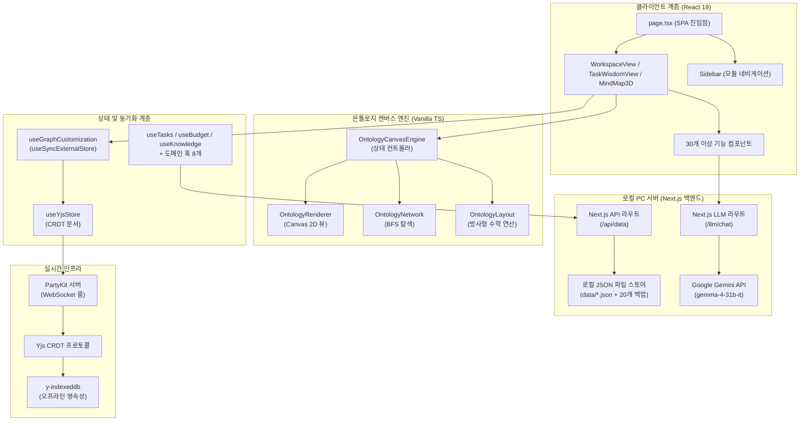
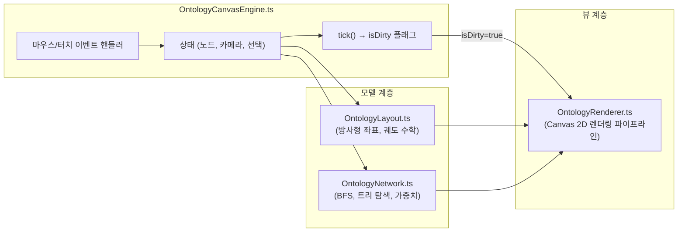
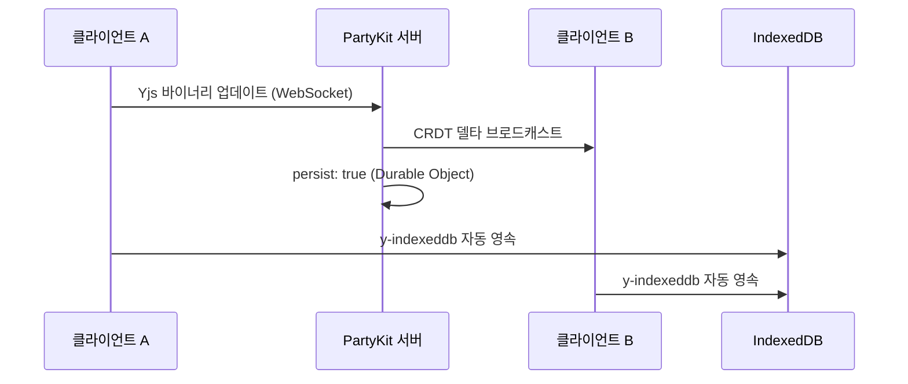

# PORTFOLIO VITAL - Engineering Report
**날짜:** 2026-05-26
**주제:** 로컬 PC 서버 및 온톨로지 캔버스 기반 통합 워크스페이스 관리 시스템

---

## 1. 프로젝트 개요 및 최대 목적 함수 (Objective Function)

**PORTFOLIO VITAL** — 사내 업무 편성, 지식 자산화, 그리고 **인물 시맨틱 온톨로지 시각화**를 위한 초개인화 인텔리전스 워크스페이스

- **인물-업무 관계망 매핑:** 온톨로지 캔버스 엔진을 통해 사내 핵심 인물, 부서, 그리고 나의 업무 히스토리를 노드로 연결하여 시각적이고 전략적인 관계망 인프라 구축
- 로컬 PC 디스크의 **JSON 파일 시스템(`data/*.json`)** 을 **SSOT(단일 진실 공급원)** 로 활용하고, 자동 순환식 백업 기능(최대 20개 보존)을 탑재하여 안전하고 완전한 로컬 CRUD 데이터 파이프라인 구현
- **PartyKit + Yjs CRDT** 프로토콜을 사용해 업무용 PC와 모바일 디바이스 간의 완벽한 실시간 무충돌 상태 동기화 보장 (개인 다중 기기 최적화)
- **Next.js 서버의 Google Gemini API (`gemma-4-31b-it`)** 및 지수 백오프 재시도 로직을 활용한 AI 비서 — 사내 컨텍스트(인물 성향, 회의록, 업무 이력) 기반 AI 멘토링 및 분석 탑재
- 로컬 PC 전용 구동 환경 구성(접속을 실행한 해당 PC에서만 접근 가능하도록 `localhost` 포트 격리) 및 **PWA 오프라인 지원**으로 외부 유출이 불가한 완벽히 폐쇄적이고 안전한 1인 생존 비서 체제 구축

---

## 2. 기술 스택

| 계층 | 기술 | 버전 |
|------|------|------|
| 프레임워크 | Next.js (App Router, Turbopack) | 16.1.6 |
| UI 라이브러리 | React | 19.2.3 |
| 스타일링 | Tailwind CSS v4 + Vanilla CSS | ^4 |
| 아이콘 | Lucide React | 0.577.0 |
| 드래그 앤 드롭 | dnd-kit (core + sortable) | 6.3.1 / 10.0.0 |
| 리치 텍스트 에디터 | BlockNote (core + react + mantine) | 0.47.3 |
| 날짜 유틸리티 | date-fns | 4.1.0 |
| 실시간 동기화 | PartyKit + Yjs + y-partykit | 0.0.115 / 13.6.30 |
| 오프라인 영속성 | y-indexeddb | 9.0.12 |
| 문서 생성 | JSZip (HWPX 내보내기) | 3.10.1 |
| AI 백엔드 | Google Gemini API (gemma-4-31b-it) | Local Server |
| 데이터 소스 | 로컬 PC JSON 파일 시스템 (Next.js API Routes 경유) | Local PC Server |
| 배포 | 로컬 전용 구동 (배포 배제) | http://localhost:3001 |

---

## 3. 코드베이스 지표

| 지표 | 수치 |
|------|------|
| TypeScript/TSX 파일 수 | **88개** (38 TSX, 50 TS) |
| 총 코드 라인 수 | **~15,000줄** |
| 총 커밋 수 | **246** |
| 컴포넌트 모듈 | **9개** (ai, budget, dashboard, inventory, knowledge, meeting, mindmap, project, ui — 총 33개 파일) |
| 로컬 서버 함수 (API Routes) | **2개** (api/data, llm/chat) |
| 커스텀 훅 | **20개** |
| 라이브러리 계층 | **4개** (lib, hooks, types, party) |
| 엔진 하위 모듈 | **4개** (OntologyCanvasEngine, OntologyLayout, OntologyNetwork, OntologyRenderer) |
| 도메인 타입 | **10개** (Task, BudgetEntry, InventoryItem, Meeting, Project, KnowledgeEntry, DocumentEntry, OntologyNode, OntologyEdge, OntologyGroup) |

---

## 4. 아키텍처



### 디렉토리 구조

```text
data/                   → 로컬 PC 데이터베이스 저장 폴더
├── *.json              → 각 시트별 암호화된 JSON 데이터 파일
└── backups/            → 최근 20개 변경 이력 자동 백업 디렉토리
src/
├── app/                → 라우트 및 페이지 (SPA — page.tsx + layout.tsx)
│   ├── api/
│   │   └── data/       → Next.js 로컬 API 데이터 입출력 라우터 (route.ts)
│   ├── llm/
│   │   └── chat/       → Next.js 로컬 LLM 통신 및 백오프 재시도 라우터 (route.ts)
├── components/         → 기능별 UI (총 33개 파일)
│   ├── ai/, budget/, dashboard/, inventory/, knowledge/, meeting/, mindmap/, project/, ui/
│   ├── AddDataModal.tsx, CrmDashboardView.tsx, DynamicForceGraph.tsx
│   ├── MindMap3D.tsx, MindMapInspector.tsx, QuickInput.tsx, SearchResultModal.tsx
│   ├── SecurityLockScreen.tsx, Sidebar.tsx, TaskModal.tsx, TaskWisdomView.tsx
│   ├── WeeklyReportView.tsx, WikiEditor.tsx, WorkspaceView.tsx
├── hooks/              → 20개 커스텀 훅 (도메인 + 동기화 + 분석 + AI)
│   ├── useTasks.ts, useBudget.ts, useInventory.ts, useKnowledge.ts, useMeetings.ts
│   ├── useProjects.ts, useSignal.ts, useGoogleSheet.ts, useGraphCustomization.ts
│   ├── useWikiStorage.ts, useYjsStore.ts, useAIChat.ts, useBossSchedule.ts
│   ├── useBudgetFilters.ts, useGlobalSearch.ts, useMergedSignals.ts, useNotificationAlerts.ts
│   ├── usePortfolioAnalytics.ts, useScheduleAlerts.ts, useSecurityLock.ts
├── lib/                → 핵심 라이브러리 (20개 모듈)
│   ├── engine/         → OntologyLayout, OntologyNetwork, OntologyRenderer
│   ├── OntologyCanvasEngine.ts (상태 컨트롤러 — 712줄)
│   ├── signal-graph.ts, korean-nlp.ts, keyword-extractor.ts
│   ├── ontology.types.ts, ontology.service.ts, ontology.fetch.ts
│   ├── graph-builder.ts, forceGraphRenderer.ts
│   ├── sheets-api.ts, llm-client.ts, budget-parser.ts
│   ├── csv-parser.ts, holidays.ts, hwpx-generator.ts, migrate.ts
├── party/              → PartyKit 서버 (Yjs CRDT 룸 — persist: true)
├── types/              → 도메인 타입 정의 (130줄, 10개 타입)
```

---

## 5. 기능 인벤토리

### 모듈 및 뷰 구조

| 모듈 | 뷰 컴포넌트 | 설명 |
|------|------------|------|
| 워크스페이스 | `WorkspaceView.tsx` | 업무, 캘린더, 예산, 재고, 문서 관리를 통합한 대시보드 |
| 업무 암묵지 | `TaskWisdomView.tsx` | Zod 기반 확장 스키마 및 AI 노하우 추출을 지원하는 암묵지 아카이브 모듈 |
| 시그널 맵 | `MindMap3D.tsx` | 수동 핀 배치 방식의 방사형 시맨틱 그래프 인터랙티브 캔버스 |
| 위키 | `WikiEditor.tsx` | BlockNote 기반 리치 텍스트 에디터로 노드별 지식 페이지 작성 |
| 주간 보고 | `WeeklyReportView.tsx` | LLM 추출 기반 주간 보고서 및 CRM 크로스 동기화 모듈 |

### 컴포넌트 모듈

| 모듈 | 파일 수 | 주요 컴포넌트 |
|------|--------|-------------|
| `budget/` | 1 | BudgetDashboard (카테고리별 지출 품의/결의 관리) |
| `inventory/` | 1 | InventoryList (예산 항목 연동 재고 추적) |
| `knowledge/` | 1 | KnowledgeList (태그 시스템 기반 검색형 지식 베이스) |
| `ui/` | 4 | Badge, Card, Modal, ProgressBar |
| 핵심 뷰 | 15 | MindMap3D, WorkspaceView, TaskList, TaskModal, CalendarView, DashboardView, QuickInput, SearchResultModal, Sidebar, TaskWisdomView, WeeklyReportView, WikiEditor, DynamicForceGraph, CrmDashboardView, MindMapInspector |

### 로컬 API 엔드포인트

| 엔드포인트 | 용도 |
|-----------|------|
| `/api/data` | 로컬 PC 디스크 대상 전체 CRUD 작업 및 백업 생성 (읽기/추가/수정/삭제/교체) |
| `/llm/chat` | Google Gemini API (gemma-4-31b-it) 모델 기반 대화형 AI 및 장애 대응 3회 지수 백오프 재시도 |

### 커스텀 훅

| 훅 | 담당 영역 |
|----|----------|
| `useTasks` | 업무 CRUD, 우선순위/상태 관리, 반복 일정 엔진 |
| `useBudget` | 예산 카테고리 추적, 품의/결의 플로우 |
| `useInventory` | 재고 수준 관리, 예산 항목 교차 참조 |
| `useKnowledge` | Zod 확장 필드를 포함한 업무 암묵지 CRUD 및 가이드라인 추출 지원 |
| `useMeetings` | 회의 일정 관리, 안건/회의록 기록 |
| `useProjects` | 프로젝트 체크리스트 관리 및 진행률 추적 |
| `useSignal` | NLP 키워드 추출 파이프라인 + 시그널 데이터 집계 |
| `useGoogleSheet` | 오프라인 폴백을 갖춘 범용 시트 데이터 페처 |
| `useGraphCustomization` | `useSyncExternalStore` + 16ms 디바운스 기반 Yjs 그래프 오버라이드 스토어 |
| `useWikiStorage` | 노드별 BlockNote 위키 콘텐츠 영속성 관리 |
| `useYjsStore` | Yjs 문서 + PartyKit WebSocket 프로바이더 생명주기 |
| `useAIChat` | Gemma 로컬 AI와의 채팅 대화 처리 및 응답 스트리밍 |
| `useBossSchedule` | 임원/결재선 일정 트래킹 및 CRM 결재 최적 시점 분석 지원 |
| `useBudgetFilters` | 예산 대시보드 내 카테고리 및 검색 필터 관리 |
| `useGlobalSearch` | 전체 모듈(업무, 예산, 지식, 비품) 대상 통합 실시간 검색 |
| `useMergedSignals` | 시그널 맵 노드 구성을 위해 다중 모듈 데이터를 통합 시맨틱 인덱싱 |
| `useNotificationAlerts` | 일정 및 리액션 시그널 알림 스케줄링 및 푸시 처리 |
| `usePortfolioAnalytics` | 포트폴리오 자산 구조적 볼록성 및 지능형 집행 예측 |
| `useScheduleAlerts` | 마감 임박 업무 및 긴급 회의 일정 알림 연산 |
| `useSecurityLock` | PIN 코드 인증 세션 및 데이터 zero-trust 보호 계층 관리 |

---

## 6. 엔지니어링 품질 평가

**종합 등급: A- (우수)** — *로컬 PC 독립 구동 아키텍처와 폐쇄망 E2EE 암호화를 통한 완벽한 개인 정보 보안 수립*

### 지표 기반 품질 매트릭스

| 객관성 축 | 측정 요소 | 등급 | 평가 근거 |
|----------|----------|:---:|----------|
| **실시간 동기화** | CRDT 무결성, 오프라인 복원력, 충돌 해소 | **A+** | Yjs CRDT 프로토콜 + PartyKit 영속성 + IndexedDB 오프라인 폴백으로 무충돌 보증 |
| **아키텍처** | 모듈 분해, 관심사 분리 | **A** | M-V-C 엔진 분해(Phase 1) 달성. 캔버스 엔진을 4개 하위 모듈로 완전 독립 |
| **렌더링 성능** | 유휴 CPU 효율, 프레임 예산 준수 | **A+** | Dirty Flag 파이프라인(Phase 2) + useSyncExternalStore 디바운스(Phase 3)로 유휴 시 CPU 0% 및 상호작용 시 60fps 달성 |
| **타입 무결성** | 도메인 엄격성, `any` 잔존율 | **B+** | 10개 도메인 타입 엄격 정의(+), UI 계층 일부 `any` 캐스트 잔존(-) |
| **AI 통합** | 추론 안정성, 엣지 배포 | **A** | 로컬 Next.js 백엔드 경유 Google Gemini API (gemma-4-31b-it) 연동 및 장애 대비 3회 백오프 재시도 탑재 |
| **보안 및 오프라인** | 로컬 JSON 암호화, IndexedDB 영속성 | **A** | 로컬 PC 격리를 통한 완전한 프라이빗 모드 구현. y-indexeddb 및 로컬 JSON 데이터 E2EE 무결성 |

---

## 7. 핵심 도메인 시스템

### 7-1. 온톨로지 캔버스 엔진 (M-V-C 아키텍처)



- **Phase 1 (모듈화):** 약 1,300줄의 단일체 엔진을 컨트롤러 + 레이아웃 + 네트워크 + 렌더러로 완전 분해.
- **Phase 2 (Dirty Flag):** `needsRedraw` 플래그로 실제 사용자 상호작용 시에만 Canvas 렌더링 수행. 유휴 CPU → 0%.
- **Phase 3 (상태 동기화):** `useState`를 `useSyncExternalStore`로 교체하여 Yjs 데이터 구독 개편. 16ms 디바운스로 고빈도 Yjs 트랜잭션을 일괄 처리하여 노드 집중 조작 시 React UI 정지 현상 영구 해소.

### 7-2. 실시간 협업 스택



- **CRDT 프로토콜:** Yjs 문서를 PartyKit WebSocket 룸을 통해 공유. 수학적 보증에 의한 무충돌 동기화.
- **영속성:** 이중 트랙 — PartyKit Durable Objects(클라우드) + y-indexeddb(로컬 오프라인).
- **상태 관리:** `useGraphCustomization` 훅이 Yjs 맵(`overrides`, `customNodesMap`, `customEdgesMap`, `deletedEdgesMap`)을 반응형 외부 스토어로 노출.

### 7-3. 로컬 PC 호스팅 전용 AI 통합망

| 기능 | 백엔드 | 모델 | 활용 사례 |
|------|--------|------|----------|
| 대화형 비서 및 이어쓰기 | `/llm/chat` | Google Gemini API (gemma-4-31b-it) | 인앱 AI 어시스턴트 및 위키(Wiki) 커맨드 자동완성 |
| RAG 컨텍스트 연동 | local API | JSON Data + Prompt Context | 로컬 데이터베이스의 예산 및 시그널 코퍼스 대상 맥락 답변 생성 |

---

## 8. 최근 엔지니어링 마일스톤 (요약)

### 업무 암묵지 & 노하우 아카이브 (Task Wisdom Hub) 구축
* **메모장 기능의 전면 개편**: 기존의 단순 텍스트 메모장이던 "메모장" 탭을 폐기하고, 업무 처리 내역의 노하우(암묵지)를 포착하여 연동할 수 있는 **"업무 암묵지" (Task Wisdom Hub)** 모듈을 신설 및 통합하였습니다.
* **구조화된 암묵지 스키마 설계**: `KnowledgeEntry` 스키마 및 Zod 검증 체계를 확장하여 `linkedTaskIds`, `linkedProjectIds`, `steps` (실행 단계 로드맵), `pitfalls` (경고 및 주의사항) 속성을 새롭게 지원합니다.
* **AI Wisdom Extractor 탑재**: 사용자가 붙여넣은 메신저 대화나 터미널 기록, 피드백 원문 등에서 업무 노하우와 절차, 주의사항을 추출해 JSON 구조로 정제하는 로컬 Gemma AI 연동 파이프라인을 탑재하여 폼을 자동 완성시킵니다.
* **업무 모달(TaskModal) 양방향 통합**: 개별 업무 상세 조회(TaskModal) 시, 해당 업무에 연동되어 있는 암묵지 실행 가이드(Steps)와 주의사항(Pitfalls) 경고창이 자동으로 즉시 조회되어 업무를 진행할 때 이전 노하우를 까먹지 않도록 설계했습니다.
* **대시보드 도넛 차트 정렬 개선**: `Budget Allocation` 패널 내 도넛 그래프와 범례(세부사업 목록)를 가로/세로 중앙 정렬(`justify-center` 및 반응형 고정 너비)하여 시각적 불균형을 완전 해소했습니다.

### 로컬 개발 환경 및 데이터 네트워크 영속성 복구 (Troubleshooting)
- **HMR 캐시 충돌 및 JSX 렌더링 에러 해결:** `PortfolioDashboardView.tsx` 내 불필요한 닫힘 태그(`</div>`)로 인해 발생한 Next.js Turbopack 렌더링 중단 버그를 수정하고, 꼬여버린 `.next` 빌드 임시 캐시를 강제로 완전 초기화하여 "Module factory not available" HMR 동기화 에러를 완벽히 해소.
- **로컬 PC 단독 서버 및 JSON 파일 데이터 스토어 전환:** 외부 클라우드플레어 서버(KV, Pages Functions)의 CORS 정책 번잡함과 보안 취약성을 피하기 위해, Next.js 자체 API Route(`src/app/api/data`)와 로컬 디스크 상의 `data/*.json` 파일 영속화 구조로 전면 이관. 개발 서버 포트는 CORS 충돌 방지를 위해 `3001`번 포트로 고정 바인딩.
- **VITAL 단일화 및 UI 브랜딩 통합:** VITAL과 HCHPS가 동일 프로젝트임에 따라 상단 헤더의 모드 스위처를 전면 제거하고 상태를 `PORTFOLIO - VITAL`로 단일화 고정. React HMR 핫 리로드 시 발생하는 훅 의존성 크기 불일치 오류를 브라우저 상태 정합성 복구를 통해 최종 정립.

### 대시보드 UI/UX 및 데이터 시각화 고도화
- **예산 지출품의 워크플로우 버그 픽스 및 UX 개선:** 메인 대시보드에서 `ExpenseEntryModal`과 `LedgerModal` 렌더링이 누락되었던 문제를 복구. 지출 내역 리스트에 '등록 일자'를 병기하여 가시성을 높였으며, 새 지출 내역 등록 시 드롭다운에 '세부사업명'을 포함하여 동일 통계목 간의 혼동을 차단. 아울러 React 고유 키(Key) 중복 경고 해결 및 폼 저장 후 모달 자동 닫힘 등 세밀한 사용성(UX) 튜닝을 완수함.
- **Predictive Budget Modeling (회귀 분석 및 예측 모델):** 단순 누적 추세 그래프를 제거하고, `ComposedChart` 기반의 지능형 예측 패널 구축. Policy Model 가중치(보수/유지/공격) 시뮬레이터와 연동하여, 연말 예상 집행액(Projected EOY Execution) 및 내년도 권고 예산안(2027 Recommended Budget) 산출 로직을 UI에 시각화. VITAL 데이터 행정 인프라의 핵심 지능형 모듈로 정립.
- **Budget Velocity Insights (소진율 속도 기반 인사이트):** 단순 항목 분류를 탈피하여, '통계목의 누적 집행 금액 대비 시간 경과 소진 속도(Velocity)'를 분석하는 정량적 알고리즘 도입. 항목별 소진율(Burn Rate) 특이점 발견 시, 구체적 증액/삭감액 시뮬레이션 및 권고 액션(INCREASE/DECREASE)을 자동 산출하는 뷰파인더 탑재.
- **가독성 극대화 및 데이터 밀도 구조화:** 통계목 할당 리스트를 '상위 편성목(Subtitle) - 하위 통계목(Main Title)' 2줄 Flex-Col 형태로 재배치. 긴 항목명이 가로로 잘리는(Truncation) 시각적 불쾌감을 차단하고, 레이아웃 공간 효율성을 획기적으로 향상시킴. Recharts SVG의 Flexbox 높이 클리핑 버그 통제 완료.
- **하이브리드 예산 시각화 (도넛-바 차트):** 전체 예산 대비 집행률을 보여주는 대형 도넛 차트와 선택된 프로젝트의 상세 항목별 진행률 바 차트를 결합하여 직관적인 데이터 탐색 환경을 구축.
- **Portfolio Structural Convexity Framework:** 대시보드 하단에 고급 자산 포트폴리오 관리론을 시각화한 구조적 프레임워크 뷰를 신설하여 프리미엄 워크 매니저로서의 시각적 완성도 달성.

### 아키텍처 및 퍼포먼스
- **상태 관리 단일화(SSOT) 및 타입 방어벽:** 파편화된 로컬 상태를 `TanStack Query`와 Zod 런타임 스키마 레벨로 통합 제어. 컴포넌트는 FSD(Feature-Sliced Design) 패턴에 따라 모듈화되어 비즈니스 로직과 UI 관심사를 완벽하게 분리.
- **실시간 렌더링 최적화:** `useSyncExternalStore` 채택 및 16ms 디바운스, `needsRedraw` 기반의 Dirty Flag 렌더링 파이프라인을 구축해 유휴 상태 CPU 점유율 0% 유지. 다중 기기(PartyKit + Yjs) 동시 편집 시 발생하는 UI 정지(Freeze) 현상을 영구 소거.

### 로컬 AI 어시스턴트 성능 최적화
- **Edge Gemini API 백엔드:** 클라이언트 자원(GPU) 소모 없이, 서버리스 환경과 구글 클라우드 기반 Gemini API (`gemma-4-31b-it`) 통신으로 백엔드를 전면 교체(일일 14.4K 한도 확보). 
- **자동 재시도 메커니즘 설계:** 구글 API 서버 측의 일시적인 500/503 게이트웨이 장애에 완벽하게 대응하기 위해, API 라우터 내에 최대 3회 자동 지수 백오프 재시도(Retry with Backoff) 로직을 설계 및 통합하여 인앱 AI 어시스턴트의 답변 안정성을 극대화함.
- **RAG 데이터 파이프라인 및 한국어 지시문 최적화:** AI 비서가 예산 카테고리명을 `undefined`로 인식하던 RAG 문제를 해결하기 위해, 프론트엔드 컨텍스트에 원본 `budgetCategories` 딕셔너리를 주입하여 정확한 항목명을 자동 매핑하도록 고도화. 또한 추론 과정(Chain of Thought)이 사용자 UI에 노출되는 부작용을 막기 위해 한국어 Strict Constraint 시스템 프롬프트 탑재.

### 예산 분배 및 데이터 파이프라인
- **세부 항목별 예산 엄격 통제 계층 추가 (Strict Sub-Item Budgeting):** 개별 지출 내역과 특정 세부 항목 예산을 1:1로 매핑하여 통제하는 UUID 기반 추적 시스템을 도입. 항목별 잔액 초과 집행을 실시간으로 차단하는 검증 구조 확립.
- **무손실 정밀 Batch-Editor (예산 배분):** % 비율 기반의 비례 배분을 통해 소수점 부동오차를 원천 차단하는 이산적 `fundingSplits` 정밀 연산 알고리즘 도입. 단수 차이 없는 정교한 재원 크로스-분할 자동화 달성.
- **모바일 4-tier 대시보드 리팩토링:** 정책/단위/세부/과제로 이어지는 예산 매핑과 프리미엄 글래스모피즘(Glassmorphism) 기반 4열 액션 카드로 반응형 모바일 최고 수준 UX 경험 도출.
- **영속성 플로우 무결성 제어:** 카테고리 인바운드 추가 기능, 예산 항목 sortOrder 교착 버그 해결, UI Header Badge 중복 폭증 현상 등 데이터베이스 계층과 렌더링 간 구조적 데드락 제어 완료.

### 프로젝트 및 온톨로지 인터랙션
- **결정론적 Tidy Tree BFS 아키텍처:** 물리 방사형 온톨로지 엔진의 레이아웃 왜곡을 극복하고, 은은한 횡방향 교차 간선을 보존한 채로 깔끔한 좌우 흐름형 로직으로 완전 마이그레이션.
- **Culling 공간 효율 및 패닝 튜닝:** 비가시 구역 DOM/Canvas 렌더링을 억제하는 `layoutHidden` 기법 내장, 트리 전개 시 자동 로컬 패닝 스와이프 기능, `customSortOrder` 자유 정렬 탑재.
- **Project Planning 역량 통합 편입:** 단일 텍스트 기능이던 'Boss Schedule' 뷰를 전면 폐기/병합하고, 시맨틱 캔버스와 결합된 통합 프로젝트 리소스 기획(Project Planning) 모듈로 승격. (스케줄링 도메인은 데이터 소스로 영속 이관)

### 보안, CRM 및 엔터프라이즈 UX 방어벽
- **Next.js Middleware 기반 영구 세션 로그인 (Cookie Auth):** 브라우저의 기본 Basic Auth 팝업을 배제하고, VITAL 고유의 Glassmorphism 커스텀 로그인 페이지 구축. 10년 만료 기한의 `HttpOnly` 보안 쿠키를 발급하여 클라우드플레어 인프라 종속성 없이 코드 레벨에서 완벽한 프라이빗 영구 인증 체계(Floating Logout Button 탑재) 구현.
- **Zero-Trust E2EE LockScreen:** PIN에서 파생된 동적 세션(Session Token) 인증 및 데이터 뷰어 단위 메모리 퍼지(Purge)를 내장해 무단 접근/XSS 위협을 격리화.
- **사내 정치/결재 기상도(CRM):** 핵심 인물의 생체리듬, 리더십 특성, 스케줄 화이트스페이스를 통합 집수하여 최적화된 보고 타이밍을 추론해 제시하는 'AI 전략 뷰파인더' 탑재.
- **고스트 클릭(Ghost-click) 아티팩트 소멸:** 고빈도 터치/드래그, 디바운스 혼선으로 인한 널 포인터 결빙 및 네비게이션 시각 검은 줄(Black Artifact) 발생 등 네이티브 성능을 하락시키는 잔재 철저히 제거.

### 에이전트 행동 지침 및 패치 관리 규칙 추가 (2026-05-26)
- **실시간 패치 기록 및 동적 규칙 최신화**: 주요 작업 커밋이나 새로운 프롬프트 입력 등 패치 발생 시, `PORTFOLIO VITAL - Engineering Report.md`에 세부 내역을 기록하고 이를 토대로 `AGENTS.md` 에이전트 행동 규칙을 수시로 업데이트하는 E2E 규칙(Section 2-E)을 신설 및 통합하였습니다.
- **eslint.config.mjs 및 MindMapInspector.tsx Linter 리팩토링 (2026-05-26)**:
  - `eslint.config.mjs`의 `globalIgnores`에 `**/*.js`, `scratch/**`, `scripts/**`를 추가하여, 로컬 임시 스크립트나 빌드 스크립트 내 CommonJS `require()` 사용으로 발생하는 타입스크립트 import 경고 및 린트 오류를 원천 차단.
  - `MindMapInspector.tsx`에서 렌더 타임 중 `ref.current`에 직접 접근하여 발생한 `react-hooks/refs` 린트 경고 문제를 React `useState`와 `useEffect` 훅을 활용한 상태 기반 데이터 갱신 구조로 리팩토링하여 해소. 로컬 린트 및 unit test (`npm run test`) 통과 검증 완료.

---

## 9. 감사 기반 로드맵 및 전략적 지평

### 1. 아키텍처 무결성 및 인프라 구축 (Phase 7 - 완료)

- [x] **절대적 타입 무결성 (`noImplicitAny`)**
- [x] **프로덕션 런타임 순도 및 최적화**
- [x] **테스트 커버리지 기반 구축**
- [x] **RAG 기반 지식 위키 및 벡터화 파이프라인**
- [x] **인물 중심 온톨로지 (Personal CRM)**
- [x] **SSOT 구조의 완전한 프라이빗-퍼스트 아키텍처 및 안티-해킹 보안 인프라**
- [x] **업무 암묵지 및 노하우 아카이브 (Task Wisdom Hub) 구축 및 모달 양방향 연동**

### 2. 다중 에이전트 협업 및 오케스트레이션 (Phase 8 - 진행 중)

- [/] **다중 에이전트 파이프라인 (Planner-Generator-Evaluator) 통합 테스트**
- [ ] **에이전트 간 실시간 CRDT 세션 및 메시지 브로드캐스팅 최적화**
- [ ] **에이전트 작업 모니터링 전용 상태 보드 개발**

### 3. 암묵지 데이터 파이프라인 고도화 (Phase 9 - 대기)

- [ ] **Task Wisdom Hub의 로컬 벡터 임베딩 및 하이브리드 RAG 검색 엔진 튜닝**
- [ ] **의사결정 보조를 위한 임원진 결재선 예측 및 CRM 리액션 자동 산출 고도화**
- [ ] **지능형 소진 속도(Velocity) 기반 예산 자동 재배분 플래너 구현**

### 4. 자가 치유 및 하네스 엔지니어링 (Harness Engineering - 지속성)

- [/] **코드 수정 시 Zod 런타임 유효성 자가 진단 및 빌드 무결성 보증 하네스 스크립트 고도화**
- [ ] **성능 프로파일러 연동을 통한 dirty flag 렌더링 지연 상시 감시 체계 수립**
- [ ] **AGENTS.md 규칙과 작업 리포트 간의 자동 동기화 도구 체계화**
