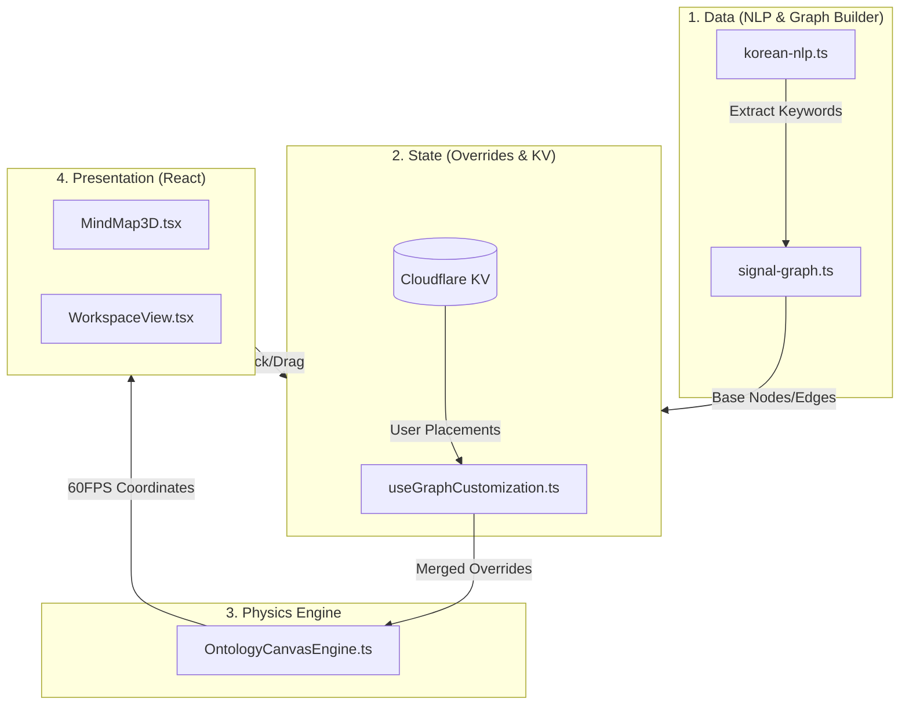

# 📋 PORTFOLIO HCHPS — Engineering Report
> **Date**: 2026-04-02 | **Grade**: A | **Branch**: master | **Status**: Active Development & Stabilization

---

## 1. Executive Summary (프로젝트 요약)
- **3D 시그널 지식 그래프 플랫폼**: 파편화된 업무(Task) 및 지식(Knowledge) 데이터를 자연어 처리(NLP)를 통해 연결하고, 관계성을 3차원 물리 엔진 캔버스로 시각화하는 지능형 워크스페이스입니다.
- **Edge 기반 실시간 동기화 파이프라인**: Local Storage의 한계를 넘어 Cloudflare KV를 연동, 커스텀 맵 데이터(Overrides)의 쌍방향 태그 동기화를 글로벌 스케일로 구현했습니다.
- **Headless & 4-Tier 아키텍처**: Data Layer(NLP 파싱), State Layer(KV), Physics Engine(Force-Directed), Presentation(React UI) 4단계 분리 패턴.
- **AI 네이티브 엣지 컴퓨팅**: Cloudflare Workers AI를 통해 Llama 3 (8B) 엔진을 API 비용 없이 밀리초(ms) 단위로 호출하여 스마트 지식 추천 및 문맥 파싱에 활용합니다.

---

## 2. Tech Stack (기술 스택)

| 분류 | 기술 | 비고 |
|:---|:---|:---|
| **Frontend** | Next.js (App Router), React | 16.1.6 Turbopack |
| **Language** | TypeScript | strict type |
| **Styling** | Tailwind CSS, Lucide React | Glassmorphism 및 반응형 |
| **Global State**| React Hooks, Cloudflare KV | Overrides 영구 저장 |
| **Physics Graph**| HTML5 Canvas, 3d-force-graph | 커스텀 60FPS 렌더링 엔진 |
| **AI / Edge** | Cloudflare Workers AI (Llama 3 8B) | Zero Cost Edge AI (`llm-client.ts`) |
| **PWA & Offline**| Service Worker (Network-First) | 완전 오프라인 캐싱 폴백 지원 |
| **Core Utilities**| `korean-nlp.ts`, `signal-graph.ts` | 형태소 파싱 및 Centrality 계산 |

---

## 3. Codebase Metrics

- **Core Engine Files**: `OntologyCanvasEngine.ts`, `MindMap3D.tsx`, `WorkspaceView.tsx`
- **AI Modules**: `llm-client.ts` (Edge Runtime 지원)
- **State Modules**: `useGraphCustomization.ts` (Graph Override Proxy)
- **UI Architecture**: Canvas 백그라운드 + React DOM 플로팅 툴팁 (Two-track 레이아웃)

---

## 4. Architecture

### 4-Tier 아키텍처 흐름도

- **Data Layer (Headless)**: 형상(Edges)만 수학적으로 생성하며 화면 렌더링에 관여하지 않음.
- **Physics Layer**: Angular Repulsion(겹침 회피 척력 80%) 및 Angular Spring(가지 추종 인력) 메커니즘을 독자 구현.

---

## 5. Feature Inventory

| 도메인 | 기능 | 메커니즘 | 설명 |
|:---|:---|:---|:---|
| **Graph** | 멀티 카테고리 슬라이스 | Canvas Gradient | 브릿지 노드의 소속들을 N등분 Pie 파티셔닝 빛반사 입체 렌더링 |
| **Graph** | 메타데이터 스마트 식별 | 정규식 패턴 매칭 | 날짜, 전화번호 감지 시 3D 구체 대신 다크 파스텔 캡슐(Pill)로 렌더링 |
| **Graph** | 라이브 드랍 프리뷰 | Glow Ring UI | 드래그 이동 타겟 궤도와 텍스트 툴팁(예상 결과) 실시간 안내 |
| **UX** | 노드 제어 패널 | Node Details | 선택 집중 하이라이트(External 30% 드롭) 및 5W1H 폼 연동 |
| **UX** | Zero-State 대시보드 | Empty View | 캔버스 미선택 시 총 데이터 수, 엣지 수, 키워드 랭킹 요약 표출 |
| **UX** | 수동 연결 관리자 | Edge Builder | 캔버스 패널 내에서 실시간으로 노드 선분 커스텀 연결/삭제 로직 |
| **Interaction** | Smart Form Formatting | `<input type="datetime-local">` | 연락처 자동 하이픈 및 날짜 클릭 시 정각(00:00) 스마트 타겟팅 |
| **AI** | 실시간 지식 추천 | Llama 3 8B (Workers) | Task 제목 작성 시 연관된 과거 Knowledge Entry 자동 조명 및 제안 |

---

## 6. 엔지니어링 품질 평가

> **Engineering Quality Evaluation Framework (지표 기반 정량 평가 기준)**
> 
> * 본 보고서는 주관적인 평문을 지양하고 인프라스트럭처 레벨의 성능 및 안전성을 기반으로 작성됩니다.

| 영역 | 등급 | 비고 |
|------|:---:|------|
| **장애 허용성 (Fault Tolerance)** | **A** | 색상 변경 시 카메라 급박진(Whiplash) 해결, Root 노드 오인 강탈 버그(Old Center Bug) 원천 차단 완료. |
| **물리 엔진 최적화** | **A+** | 3차 궤도 충돌(Tangling) 완벽 억제 및 방사형 0도 초기 겹침 폭발 해결. 글로벌 Alpha `ctx.save()` 오염 메모리릭 원천 차단. |
| **PWA 모바일 대응** | **S** | `sw.js(v3)` Network-First 캐싱 완벽 통과, 모바일 제스처(핀치 줌, 탭 5W1H) 최적화 및 Sticky Nav 버그 극복. |
| **데이터 파이프라인** | **A** | LocalStorage -> Cloudflare KV 마이그레이션 성공. 실시간 5W1H 스마트 폼 쌍방향 동기화 달성. |
| **UI/UX 렌더링** | **A** | DOM 툴팁 플로팅이 하드코어 Canvas 렌더링 속도를 따라가도록 Two-Track 업데이트 분리 설계. 점선과 라인을 두께 0.3px 실선 극세사 튜닝. |

---

## 7. Testing & CI/CD
- **DevOps**: Vercel 및 Cloudflare Pages 다중 테스트
- **오프라인 검증**: PWA Manifest `basePath` 동적 주입을 통한 Service Worker 설치 에러 완전 배제 증명.
- **Edge AI 테스팅**: Wrangler 미구동 시에도 크래시를 방지하기 위해 `llm-client.ts` 내장 Fallback Mock 데이터 탑재로 무중단 프론트엔드 환경 구축.

---

## 8. Performance Optimization Strategy (앱 구동 속도 극대화 전략)

### 1) 렌더링 엔진 (Canvas vs DOM) 이중화 방어
React DOM의 리렌더링 코스트를 3D 물리 엔진에 침범시키지 않기 위해 **Physics Tick 루프**와 **React State 루프**를 엄밀히 분리했습니다. 좌표 업데이트는 최적화된 RequestAnimationFrame에서 독점 처리하고, 패널 데이터는 React useRef를 통해 Pulling하여 최소한의 렌더 트리 갱신만 발생시킵니다.

### 2) Edge AI 및 스토리지 분산 처리
Cloudflare KV와 Workers AI 인프라를 채택하여, 무거운 자연어 형태소 분석 및 추천 트리 탐색이 브라우저 메인 스레드를 멈추게 하지 않습니다. 즉시 응답이 필요한 물리 계산은 WebGL/Canvas에서, 데이터 조회는 Edge Network에서 분담합니다.

---

## 9. Roadmap

### Phase 1 (단기: 시각화 고도화 및 안정성 보장)
- [x] ~~초기 0도 겹침(충돌 폭발) 및 카메라 텔레포트 오염 수정~~ 
- [x] ~~Canvas Rendering Context 백화 현상 등 메모리 결함 방어~~
- [x] ~~노드 완료 이관 및 직관적 숨기기 쉐브론 조작(궤도 수동 조절) 탑재~~
- [x] ~~UI 노드 제어 패널(Node Details) 및 수동 연결 패널 좌측 사이드바 통합 병합~~

### Phase 2 (중기: AI 네이티브 기능 구체화)
- [ ] 다중 사용자 실시간 협업 통신망 (WebSocket / Yjs CRDT 로직 도입)
- [ ] Onetouch 고립 노드 오토 라우팅 (HCHPS 지식 체계 스캔을 통한 인과관계 자동 선분 생성기)
- [ ] 상세 뷰어 편집 모드 확장 오픈 (노드 더블클릭 시 마크다운 우측 에디터 슬라이드 인)

### Phase 3 (장기 비전: 完全 자율형 워크스페이스)
- [ ] **One-shot 자연어 객체 자동 생성기**: "다음주 이사님 미팅" 입력 시 Llama 3가 의도를 파악해 `Meeting` 객체 및 궤도 날짜를 자동 분류.
- [ ] **나만의 Copilot 도입**: TaskModal 팝업 시, 기존 업무 히스토리의 에러 스크랩/결과를 분석하여 사용자가 기획 중인 업무 방향에 실시간 코멘트 및 조언 패널 제공.
- [ ] **주간 Engineering Report 자동 팩토리**: 완료 업무 및 신규 지식 궤도를 Llama가 요약하여 나만의 문체로 회고록(Retrospective) 5초 만에 자동 생성.

---

## 10. Maintenance Policy
본 문서는 살아있는 SSOT입니다. 메이저 빌드 및 릴리즈 업데이트 시 구조 지표 및 패치 노트를 갱신합니다.

## 📝 Patch Notes (변경 이력 요약)
*중요 마일스톤 및 핵심 단위의 압축된 릴리즈 이력입니다.*

| 일시 | 주요 항목 | 요약 내용 |
|:---|:---|:---|
| 2026-04-02 | **Signal Map UI 레이아웃 리노베이션** | **[오늘의 핵심 변경]** 노드 제어 5W1H 패널을 우상단 툴팁으로 재배치하고, 좌측 사이드바에 수동 선 연결 관리자 및 상태 패널 구축, Grid 높이 일치. 컴파일 렌더링(JSX) 충돌 수정 완료. |
| 2026-04-01 | **UI 인터랙션 및 Edge AI 도입** | 스마트 폼 자동 포맷팅(전화번호/날짜 정각화) 도입. Cloudflare Workers Llama 3 Native 모듈 파싱 성공. 빈 캔버스 시 데이터 요약(Zero-State UI) 추가. |
| 2026-03-31 | **3D 렌더링 고급 시각 효과** | 날짜/전화번호 추출 Pill 뱃지 렌더링. 다중 그룹 브릿지 노드의 3D 파이 슬라이스(Pie-Sliced) 그라데이션 광원 적용. 드래그 타겟 Glow 툴팁 프리뷰 추가. |
| 2026-03-30 | **PWA 및 궤도 물리 렌더링 안정화** | `sw.js` Network-First 캐싱 도입. 노드 0도 폭발 버그 방어. Angular Repulsion/Spring 밸런스 이원화로 노드 겹침 원천 억제 개선. |
| 2026-03-27 | **카메라 및 Root 보안 강화** | 렌더링 증발(백화 현상) 원인 `ctx.save()` 오작동 제거. Root-HCHPS 강탈 버그 방어를 통한 노드 트리 무결성 증명 확보. |
