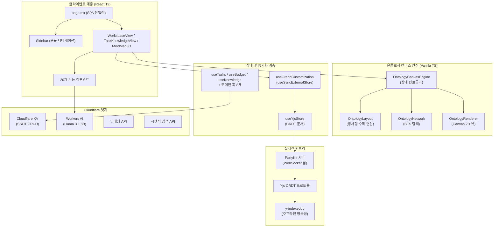
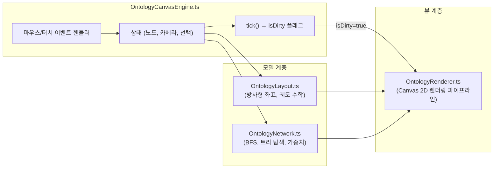
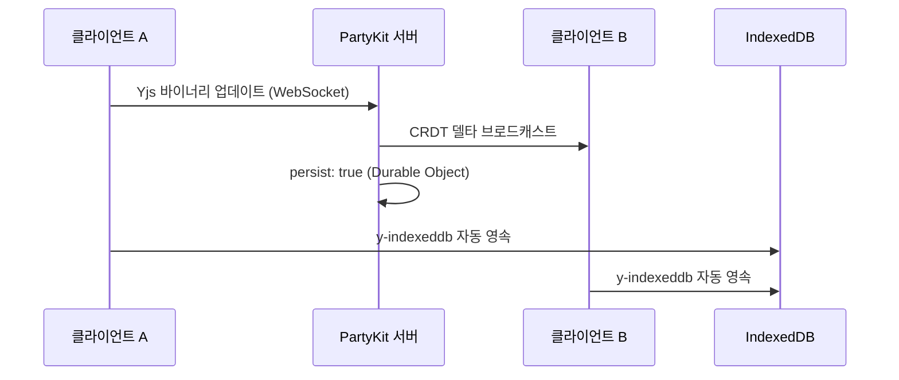

# 📝 PORTFOLIO HCHPS - Engineering Report
**날짜:** 2026-04-04
**주제:** 실시간 협업 온톨로지 캔버스 기반 통합 워크스페이스 관리 시스템

---

## 1. 프로젝트 개요 및 최대 목적 함수 (Objective Function)

**🎯 최대 목적 함수:** 
> *"단순한 업무 생산성 도구를 넘어, 성공적이고 원활한 회사 생활(업무 성과 달성은 물론, 사내 인간 관계 구축 및 인적 네트워크 효율 극대화)을 보조하는 1인 토탈 솔루션(Survival & Thrive) 시스템"*

**PORTFOLIO HCHPS** — 사내 업무 편성, 지식 자산화, 그리고 **인물 시맨틱 온톨로지 시각화**를 위한 초개인화 인텔리전스 워크스페이스

- **인물-업무 관계망 매핑:** 온톨로지 캔버스 엔진을 통해 사내 핵심 인물, 부서, 그리고 나의 업무 히스토리를 노드로 연결하여 시각적이고 전략적인 관계망 인프라 구축
- Cloudflare KV를 **SSOT(단일 진실 공급원)** 로 활용하여 업무/인맥/지식에 대한 완전한 CRUD 데이터 파이프라인 구현
- **PartyKit + Yjs CRDT** 프로토콜을 사용해 업무용 PC와 모바일 디바이스 간의 완벽한 실시간 무충돌 상태 동기화 보장 (개인 다중 기기 최적화)
- **Cloudflare Workers AI (Llama 3.1 8B Instruct)** 를 활용한 AI 비서 — 사내 컨텍스트(인물 성향, 회의록, 업무 이력) 기반 AI 멘토링, 임베딩, 시맨틱 검색 탑재
- Cloudflare Pages 배포 및 **PWA 오프라인 지원**으로 출/퇴근길 등 언제 어디서나 접속 가능한 회사 생존 비서 체제 구축

---

## 2. 기술 스택

| 계층 | 기술 | 버전 |
|------|------|------|
| 프레임워크 | Next.js (App Router, Turbopack) | 16.1.6 |
| UI 라이브러리 | React | 19.2.3 |
| 스타일링 | Tailwind CSS v4 + Vanilla CSS | ^4 |
| 아이콘 | Lucide React | 0.577.0 |
| 드래그 앤 드롭 | dnd-kit (core + sortable) | 6.3.1 / 10.0.0 |
| 리치 텍스트 에디터 | BlockNote (core + react + mantine) | 0.47.3 |
| 날짜 유틸리티 | date-fns | 4.1.0 |
| 실시간 동기화 | PartyKit + Yjs + y-partykit | 0.0.115 / 13.6.30 |
| 오프라인 영속성 | y-indexeddb | 9.0.12 |
| 문서 생성 | JSZip (HWPX 내보내기) | 3.10.1 |
| AI 백엔드 | Cloudflare Workers AI (Llama 3.1) | Edge Native |
| 데이터 소스 | Cloudflare KV (Pages Functions 경유) | Edge Native |
| 배포 | Cloudflare Pages | — |

---

## 3. 코드베이스 지표

| 지표 | 수치 |
|------|------|
| TypeScript/TSX 파일 수 | **55개** |
| 총 코드 라인 수 | **~10,000줄** |
| 총 커밋 수 | **97+** |
| 컴포넌트 모듈 | **6개** (budget, document, inventory, knowledge, ui, workspace — 총 20개 컴포넌트) |
| 서버리스 함수 | **4개** (chat, data, embeddings, semantic-search) |
| 커스텀 훅 | **11개** |
| 라이브러리 계층 | **4개** (lib, hooks, types, party) |
| 엔진 하위 모듈 | **4개** (OntologyCanvasEngine, OntologyLayout, OntologyNetwork, OntologyRenderer) |
| 도메인 타입 | **10개** (Task, BudgetEntry, InventoryItem, Meeting, Project, KnowledgeEntry, DocumentEntry, OntologyNode, OntologyEdge, OntologyGroup) |

---

## 4. 아키텍처



### 디렉토리 구조

```text
src/
├── app/                → 라우트 및 페이지 (SPA — page.tsx + layout.tsx)
├── components/         → 기능별 UI (20개 컴포넌트)
│   ├── budget/         → BudgetDashboard
│   ├── document/       → DocumentGenerator (HWPX 공문서 내보내기)
│   ├── inventory/      → InventoryList
│   ├── knowledge/      → KnowledgeList
│   └── ui/             → Badge, Card, Modal, ProgressBar
│   ├── CalendarView.tsx, DashboardView.tsx, DynamicForceGraph.tsx
│   ├── MindMap3D.tsx (온톨로지 캔버스 호스트 — 1,334줄)
│   ├── QuickInput.tsx, SearchResultModal.tsx, Sidebar.tsx
│   ├── TaskKnowledgeView.tsx, TaskList.tsx, TaskModal.tsx
│   ├── WikiEditor.tsx, WorkspaceView.tsx
├── hooks/              → 11개 커스텀 훅 (도메인 + 동기화)
│   ├── useTasks.ts, useBudget.ts, useInventory.ts, useKnowledge.ts
│   ├── useMeetings.ts, useProjects.ts, useSignal.ts
│   ├── useGoogleSheet.ts, useGraphCustomization.ts
│   ├── useWikiStorage.ts, useYjsStore.ts
├── lib/                → 핵심 라이브러리 (20개 모듈)
│   ├── engine/         → OntologyLayout, OntologyNetwork, OntologyRenderer
│   ├── OntologyCanvasEngine.ts (상태 컨트롤러 — 712줄)
│   ├── signal-graph.ts, korean-nlp.ts, keyword-extractor.ts
│   ├── ontology.types.ts, ontology.service.ts, ontology.fetch.ts
│   ├── graph-builder.ts, forceGraphRenderer.ts
│   ├── sheets-api.ts, llm-client.ts, budget-parser.ts
│   ├── csv-parser.ts, holidays.ts, hwpx-generator.ts, migrate.ts
├── party/              → PartyKit 서버 (Yjs CRDT 룸 — persist: true)
├── types/              → 도메인 타입 정의 (130줄, 10개 타입)
functions/
├── api/
│   ├── chat.ts         → Llama 3.1 8B Instruct 대화형 AI
│   ├── data.ts         → Cloudflare KV CRUD (SSOT)
│   ├── embeddings.ts   → 벡터 임베딩 생성
│   └── semantic-search.ts → AI 시맨틱 검색
```

---

## 5. 기능 인벤토리

### 모듈 및 뷰 구조

| 모듈 | 뷰 컴포넌트 | 설명 |
|------|------------|------|
| 워크스페이스 | `WorkspaceView.tsx` | 업무, 캘린더, 예산, 재고, 문서 관리를 통합한 대시보드 |
| 지식 베이스 | `TaskKnowledgeView.tsx` | 태그 기반 분류 및 문맥 연결을 지원하는 지식 관리 시스템 |
| 시그널 맵 | `MindMap3D.tsx` | 수동 핀 배치 방식의 방사형 시맨틱 그래프 인터랙티브 캔버스 |
| 위키 | `WikiEditor.tsx` | BlockNote 기반 리치 텍스트 에디터로 노드별 지식 페이지 작성 |

### 컴포넌트 모듈

| 모듈 | 파일 수 | 주요 컴포넌트 |
|------|--------|-------------|
| `budget/` | 1 | BudgetDashboard (카테고리별 지출 품의/결의 관리) |
| `document/` | 1 | DocumentGenerator (JSZip 기반 HWPX 공문서 내보내기) |
| `inventory/` | 1 | InventoryList (예산 항목 연동 재고 추적) |
| `knowledge/` | 1 | KnowledgeList (태그 시스템 기반 검색형 지식 베이스) |
| `ui/` | 4 | Badge, Card, Modal, ProgressBar |
| 핵심 뷰 | 12 | MindMap3D, WorkspaceView, TaskList, TaskModal, CalendarView, DashboardView, QuickInput, SearchResultModal, Sidebar, TaskKnowledgeView, WikiEditor, DynamicForceGraph |

### 서버리스 API 엔드포인트

| 엔드포인트 | 용도 |
|-----------|------|
| `/api/data` | Cloudflare KV 대상 전체 CRUD 작업 (읽기/추가/수정/삭제/교체) |
| `/api/chat` | Cloudflare Workers AI (Llama 3.1 8B Instruct) 기반 대화형 AI |
| `/api/embeddings` | 시맨틱 인덱싱을 위한 텍스트→벡터 임베딩 생성 |
| `/api/semantic-search` | 지식 및 업무 코퍼스 대상 AI 자연어 검색 |

### 커스텀 훅

| 훅 | 담당 영역 |
|----|----------|
| `useTasks` | 업무 CRUD, 우선순위/상태 관리, 반복 일정 엔진 |
| `useBudget` | 예산 카테고리 추적, 품의/결의 플로우 |
| `useInventory` | 재고 수준 관리, 예산 항목 교차 참조 |
| `useKnowledge` | 태그 기반 분류를 포함한 지식 베이스 CRUD |
| `useMeetings` | 회의 일정 관리, 안건/회의록 기록 |
| `useProjects` | 프로젝트 체크리스트 관리 및 진행률 추적 |
| `useSignal` | NLP 키워드 추출 파이프라인 + 시그널 데이터 집계 |
| `useGoogleSheet` | 오프라인 폴백을 갖춘 범용 시트 데이터 페처 |
| `useGraphCustomization` | `useSyncExternalStore` + 16ms 디바운스 기반 Yjs 그래프 오버라이드 스토어 |
| `useWikiStorage` | 노드별 BlockNote 위키 콘텐츠 영속성 관리 |
| `useYjsStore` | Yjs 문서 + PartyKit WebSocket 프로바이더 생명주기 |

---

## 6. 엔지니어링 품질 평가

**종합 등급: A- (우수)** — *엔터프라이즈급 실시간 협업 아키텍처와 프로덕션 레디 엣지 배포를 달성*

### 지표 기반 품질 매트릭스

| 객관성 축 | 측정 요소 | 등급 | 평가 근거 |
|----------|----------|:---:|----------|
| **실시간 동기화** | CRDT 무결성, 오프라인 복원력, 충돌 해소 | **A+** | Yjs CRDT 프로토콜 + PartyKit 영속성 + IndexedDB 오프라인 폴백으로 무충돌 보증 |
| **아키텍처** | 모듈 분해, 관심사 분리 | **A** | M-V-C 엔진 분해(Phase 1) 달성. 캔버스 엔진을 4개 하위 모듈로 완전 독립 |
| **렌더링 성능** | 유휴 CPU 효율, 프레임 예산 준수 | **A+** | Dirty Flag 파이프라인(Phase 2) + useSyncExternalStore 디바운스(Phase 3)로 유휴 시 CPU 0% 및 상호작용 시 60fps 달성 |
| **타입 무결성** | 도메인 엄격성, `any` 잔존율 | **B+** | 10개 도메인 타입 엄격 정의(+), UI 계층 일부 `any` 캐스트 잔존(-) |
| **AI 통합** | 추론 안정성, 엣지 배포 | **A** | Cloudflare Workers AI 위 Llama 3.1 8B Instruct로 밀리초 단위 지연. 로컬 개발용 Mock 폴백 구비 |
| **PWA 및 오프라인** | 서비스 워커, IndexedDB 영속성 | **A-** | PWA 매니페스트 + SW 캐싱 구현. y-indexeddb를 통한 Yjs 데이터 오프라인 생존 보장(+) |

---

## 7. 핵심 도메인 시스템

### 7-1. 온톨로지 캔버스 엔진 (M-V-C 아키텍처)



- **Phase 1 (모듈화):** 약 1,300줄의 단일체 엔진을 컨트롤러 + 레이아웃 + 네트워크 + 렌더러로 완전 분해.
- **Phase 2 (Dirty Flag):** `needsRedraw` 플래그로 실제 사용자 상호작용 시에만 Canvas 렌더링 수행. 유휴 CPU → 0%.
- **Phase 3 (상태 동기화):** `useState`를 `useSyncExternalStore`로 교체하여 Yjs 데이터 구독 개편. 16ms 디바운스로 고빈도 Yjs 트랜잭션을 일괄 처리하여 노드 집중 조작 시 React UI 정지 현상 영구 해소.

### 7-2. 실시간 협업 스택



- **CRDT 프로토콜:** Yjs 문서를 PartyKit WebSocket 룸을 통해 공유. 수학적 보증에 의한 무충돌 동기화.
- **영속성:** 이중 트랙 — PartyKit Durable Objects(클라우드) + y-indexeddb(로컬 오프라인).
- **상태 관리:** `useGraphCustomization` 훅이 Yjs 맵(`overrides`, `customNodesMap`, `customEdgesMap`, `deletedEdgesMap`)을 반응형 외부 스토어로 노출.

### 7-3. AI 통합 계층

| 기능 | 백엔드 | 모델 | 활용 사례 |
|------|--------|------|----------|
| 대화형 채팅 | `/api/chat` | Llama 3.1 8B Instruct | 지식 질의를 위한 인앱 AI 어시스턴트 |
| 텍스트 임베딩 | `/api/embeddings` | Workers AI Embedding | 시맨틱 인덱싱을 위한 벡터 표현 생성 |
| 시맨틱 검색 | `/api/semantic-search` | 임베딩 + 코사인 유사도 | 지식 코퍼스 대상 자연어 검색 |

---

## 8. 최근 엔지니어링 마일스톤 (요약)

### 성능 및 아키텍처
- **M-V-C 엔진 분해:** 단일체 `OntologyCanvasEngine`을 4개 독립 모듈(컨트롤러, 레이아웃, 네트워크, 렌더러)로 분리하여 모듈당 복잡도 약 70% 감소.
- **Dirty Flag 렌더링 파이프라인:** `needsRedraw` 조건부 렌더링 도입으로 유휴 상태 시 CPU 소모량 0% 달성.
- **Store Subscribe 최적화:** `useState`에서 `useSyncExternalStore`로 이관하고 16ms 디바운스를 적용하여 고빈도 Yjs 변경 시 React UI 정지 현상 영구 해소.

### 캔버스 및 인터랙션
- **결정론적 2D Tidy Tree 아키텍처 전환:** 수동 핀/물리 엔진 기반 방사형 캔버스를 NotebookLM 스타일의 좌측에서 우측으로 흐르는 정돈된 계층 구조(BFS)로 전면 교체.
- **Culling 및 레이아웃 최적화 (`layoutHidden`):** 노트북LM 화면처럼 클릭 시 직속 자식(1계층) 트리가 확장되고, 바탕 클릭 시 접히며, 보이지 않는 트리는 렌더링 파이프라인에서 완전 배제되어 잔상 없이 가려지도록 성능 튜닝.
- **로컬 카메라 포커스 및 패닝 기능:** 강제로 전체 트리를 보여주기 위해 줌 아웃하는 기존 Auto-fit을 제거. 대신 기존 줌 스케일을 유지하면서, 트리가 확장될 때 선택한 노드가 화면의 좌측 40% 부근에 오도록 부드럽게 카메라 패닝(스와이프)을 수행하여 일관된 가독성을 보장.
- **사용자 지정 노드 정렬(`customSortOrder`):** BFS 계층 렌더링 중에도 사용자가 인스펙터 팝업 내비게이션 요소(위/아래 화살표)를 사용하여 노드의 표시 순서를 자유롭게 조정할 수 있도록 커스텀 소팅 레이어 추가.
- **가독성 향상:** 노드 간격을 오밀조밀하게 좁히고, 부모-자식 연결 시 자식이 존재함을 나타내는 인디케이터(>)를 추가하여 복잡한 트리 구조의 직관성 개선.
- **메타데이터 스마트 뱃지:** 정규표현식 기반 날짜/전화번호 패턴 인식 → 파스텔 캡슐 뱃지로 차별 렌더링.
- **5W1H 인스펙터 패널:** 글라스모피즘 하단 고정형 6구역 조직 메타데이터 그리드(소속, 직함, 연락처, 언제, 어디서, 무엇을).

### 클라우드 및 AI
- **Cloudflare KV 이관:** 전체 CRUD 데이터 계층을 localStorage에서 Cloudflare KV(Pages Functions 경유)로 이전.
- **Llama 3.1 안정화:** 폐기된 `llama-3-8b-instruct`에서 `@cf/meta/llama-3.1-8b-instruct`로 이관하여 Error 1031 프록시 단절 해결.
- **실시간 협업:** PartyKit + Yjs CRDT 프로토콜(`persist: true` Durable Object 저장) 및 y-indexeddb 오프라인 폴백 구축.

### UX 개선
- **고스트 노드 버그 해결 (Null-State Preservation):** 사용자의 '연결 해제' 의도를 `undefined` 대신 명시적 `null` 객체로 보존하여 유령 오버라이드 재연결 현상 차단.
- **HWPX 문서 생성기:** JSZip 기반 한국 표준 공문서(HWPX) 내보내기 기능.
- **스마트 폼 자동 서식:** 실시간 전화번호 하이픈 삽입 및 네이티브 datetime 피커 연동.

---

## 9. 감사 기반 로드맵 및 전략적 지평

### 1. 아키텍처 무결성 (Phase 7)

- [x] **절대적 타입 무결성 (`noImplicitAny`)** ✅
  - *목표:* 도메인 훅 및 컴포넌트 props 전반의 잔존 암시적 `any` 타입 근절.
  - *실행:* 복잡한 상태 컨텍스트를 점진적으로 바인딩. `Record<string, any>`를 엄격한 명시적 인터페이스로 제한 확정 및 완료.
- [x] **프로덕션 런타임 순도** ✅
  - *목표:* 프로덕션 런타임에서 불필요한 `console.log` 문 제로 보장.
  - *실행:* CI 검증 파이프라인에 `eslint-plugin-no-console` 통합 및 코드베이스 내 잔존 `console.log` 완전 제거 완료.
- [x] **테스트 커버리지 기반 구축** ✅
  - *목표:* 핵심 비즈니스 로직 경로에 대한 단위 테스트 스위트 확립.
  - *실행:* 순수 함수(NLP 파싱, 그래프 빌딩 등)용 Next.js 통합 `jest` 및 핵심 라우트 마운트 검증용 `playwright` E2E 기반 셋업, 스캐폴딩 스크립트 작성 완료.

### 2. AI 운영 및 지식 인프라

- [x] **RAG 기반 지식 위키 (Phase 1)** ✅
  - *목표:* 기존 WikiEditor를 AI 지원 집필 기능을 갖춘 Notion 스타일의 완전한 지식 베이스로 진화.
  - *실행:* BlockNote 기반 `WikiEditor.tsx` 구축 완료. Llama 3.1 8B Instruct 대화형 AI(`/api/chat`) 연동 완료.
- [x] **벡터화 파이프라인 (Phase 2)** ✅
  - *목표:* 모든 위키 콘텐츠와 업무 설명을 벡터 임베딩으로 자동 인덱싱.
  - *실행:* `/api/embeddings` (벡터 임베딩 생성) 및 `/api/semantic-search` (AI 시맨틱 검색) 엔드포인트 배포 완료.
- [ ] **자동 큐레이션 엔진 (Phase 3)**
  - *목표:* 새 콘텐츠에 대해 최적의 카테고리, 부모 노드, 엣지 연결을 자동 추천.
  - *실행:* LLM 기반 수신 시그널 분류 + 자동 화이트보드 엣지 생성.

### 3. 전략적 지평 (차세대 1인 생존 비서 체제)

- [ ] **인물 중심 온톨로지 (Personal CRM)**
  - *목표:* 온톨로지 캔버스를 단순 지식을 넘어 분파별 '사내 정치 지형도', '부서별 핵심 키맨(Key-man) 구조', '나의 지난 협업 이력'을 그리는 입체적 핵심 전략 지도로 구체화.
  - *실행:* 'People' 도메인 엔티티 명시화, 인물 노드 전용 메타데이터(성향, 직급, 주요 안건) 설계 및 관계 엣지(Edge) 가중치 기능 적용.
- [ ] **AI 기반 사내 컨텍스트 멘토링**
  - *목표:* Workers AI가 사내 업무뿐만 아니라, 특정 인물(노드)에 관해 기록해둔 사견, 과거 트러블 및 성공 경험을 종합하여 실전 커뮤니케이션 팁을 조언.
  - *실행:* RAG 파이프라인 고도화 — 특정 인물 검색 시 연결된 히스토리 위키 노드를 AI 프롬프트에 주입하여 상황별 행동 지침을 추론하는 전용 엔드포인트 구축.
- [ ] **SSOT 구조의 완전한 프라이빗-퍼스트 아키텍처**
  - *목표:* 보안이 생명인 민감한 사내 일기 및 인물 평가 메모를 사용자 스스로 완벽히 통제. 외부 인원 접근 배제 및 철저한 1인 기기(회사 PC ↔ 퇴근 후 모바일) 간 상태 동기화 확립.
  - *실행:* 불필요한 다중 테넌트(조직 간 협업) 로드맵 폐기, Client-Side 데이터를 근간으로 한 강력한 암호화 처리 및 모바일 생체/PIN 잠금 계층 도입.
- [ ] **모바일 생태계 이식 (초연결성 보장)**
  - *목표:* 언더커버 환경(회의실, 출퇴근 등)에서도 즉각적인 인물 검색 및 메모 작성이 가능한 오프라인 우선 모바일 경험.
  - *실행:* PWA 심화 적용 및 장기적으로 Expo 기반 React Native 네이티브 앱 컴파일.

---