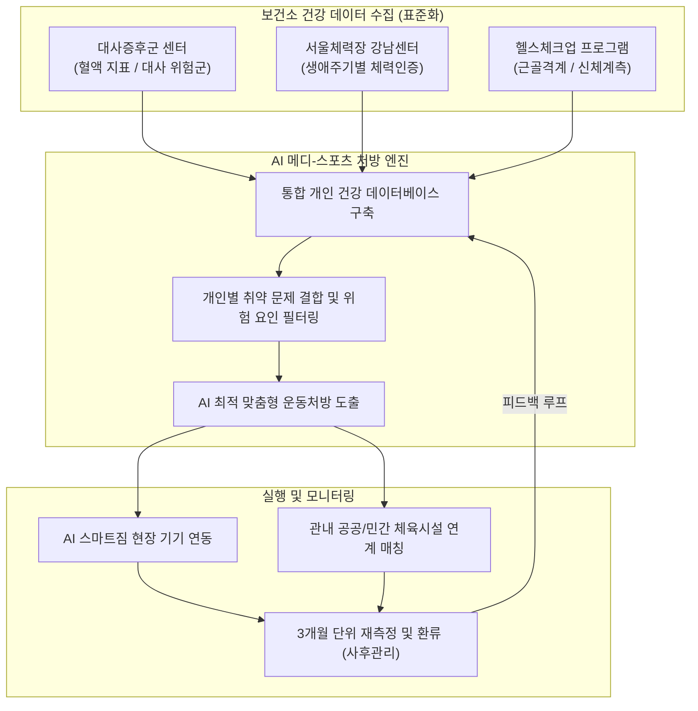

# [보고서] 강남구보건소 주요 신체활동 활성화 사업 현안 보고
**보고일자:** 2026-06-22  
**보고대상:** 신임 건강증진팀장 / 보건행정과장 및 관련 운영진  
**보고자:** 건강증진팀 신체활동 사업 소관 실무자  

---

## Ⅰ. 보고 목적
* 민선 9기 출범 및 신임 팀장 부임에 따라 보건소 소관 **신체활동 활성화 사업**의 핵심 현안을 선제적으로 정리·보고하여 원활한 정책 의사결정과 사업 연속성을 보장하고자 함.
* 분절된 건강 관리 인프라의 AI 기반 원스톱 통합(메디-스포츠) 및 건강증진지원실의 수용 능력 고도화 추진 방안 공유.

---

## Ⅱ. 주요 신체활동 사업 현안 및 추진 계획

### 1. 건강증진지원실 운영 및 '헬스체크업' 토탈케어 활성화
구민의 신체계측, 체력측정 및 자세/스트레스 분석을 기반으로 개인 맞춤형 신체활동 처방을 제공하는 직영 보건 서비스입니다.

*   **운영 체제:** 3인 직영 (건강운동관리사, 스포츠지도사, 영양사)
*   **운영 요일/시간:** 월~금(5일), 09:30 ~ 17:30 (예약제 및 일부 미예약 신체조성 측정 병행)
*   **측정 및 검진 항목:** 맥파·뇌파 스트레스 검사, 혈압, 신체조성(체성분), 체형 분석 및 움직임 검사, 혈액 변인(혈당, 혈지질 등)
*   **최근 실적 지표:** 
    *   헬스체크업 신체계측 및 처방: 2024년 1,415명 -> 2025년 상반기 675명
    *   바른자세 개선사업(거북목, 척추측만 출장검진): 2025년 4,165명 수검

> [!IMPORTANT]
> **핵심 현안: 대사증후군 검진 오전 공복 수검 병목 극복 (Split-Flow 도입)**
> *   **현황 및 문제점:** 혈액 검사(공복 제약)로 인해 일 평균 대사증후군 및 헬스체크업 대상자 39명이 오전 3시간(09:00~12:00) 동안 일시에 집중되어 극심한 대기 시간 및 상담 마비 발생.
> *   **해결 방안 (Split-Flow 모델):** 
>     *   **시차 분리 운영:** 오전에는 신속 채혈 및 체성분 계측 등 기초 검사만 단시간 내 완료하여 귀가 조치.
>     *   **상담 채널 다중화:** 건강운동관리사 및 영양사 등 다기능 인력을 재배치하여 **오전 대면 상담 채널을 3개로 동시 가동**.
>     *   **예약 슬롯 하드락킹:** 30분 단위 예약 슬롯당 수용 정원을 최대 7명(시간당 14명)으로 제한 설정하여, 오전 3시간 동안 총 39명의 검진/계측 수요를 병목 없이 완전 분산 처리함.
>     *   **심층 상담 이원화:** 종합 분석 및 세부 운동처방 상담은 오후 시간대(대면) 또는 비대면(전화/서면)으로 분산 배치하여 상담 품질 제고.

---

### 2. [공약/역점] 강남구 AI 메디-스포츠 (Medi-Sports) 센터 조성
대사증후군 센터, 서울체력장, 헬스체크업 프로그램 등 개별 분산된 검진 데이터를 통합 표준화하여 AI 기반 원스톱 운동 처방 및 스마트짐 장비 연동 관리를 수행하는 통합 인프라 구축 사업입니다.

*   **사업 기간:** 2026. 7. ~ 2027. 6. (예정)
*   **조성 장소:** 보건소 본관 4층 (기존 행정부서 이전 부지 활용, 약 500㎡ 규모)
*   **조성 인력:** 총 13명 (의사 1명, 간호사 2명, 영양사 4명, 건강운동관리사 5명, 행정인력 1명 등)
*   **세부 연계 업무 구조:**

*   **AI 추론 기반 운동 처방 시나리오 예시 (요추 디스크 당뇨 환자):**
    *   *금기 사항:* 요추에 수직 부하를 유도하는 윗몸일으키기, 스쿼트, 런지 등의 운동 일체 배제.
    *   *처방 프로그램:* 등받이 고정형 의자에 앉아 척추를 고정한 채 실시하는 단관절 상하지 근력 운동(15회/세트) 및 실내 리클라인 자전거 중강도(최대심박수 55~65%) 서킷 순환 트레이닝 주 3회 편성.
    *   *사후 관리:* AI 스마트짐 기기에 카드를 태그하면 개인 맞춤 강도로 자동 세팅 및 운동량 실시간 모니터링.

*   **실질적 운영가능성 종합 검토 (수용능력 및 주차공간):**
    *   **단계별 추진 방법 (사업 운영 방안):**
        | 구분 | 1단계 : 통합 공간 확보(전) | 2단계 : 통합 공간 확보(후) |
        | :--- | :--- | :--- |
        | **위치·규모** | 보건소 3층, 약 200㎡ | 보건소 4층 또는 5층, 약 500㎡ |
        | **추진내용** | • 헬스체크업 프로그램 • 대사증후군 관리센터 • 서울체력장 강남센터(신규) | • 헬스체크업 프로그램 • 대사증후군 관리센터 • 서울체력장 강남센터(신규) • 스마트 짐 프로그램(신규) |
        | **운영방법** | • 공간 개별, 대사증후군 검진 데이터 연계 • AI 활용 운동 처방 | • 공간 통합형 AI 메디헬스센터 조성 • 자체 전산 시스템 구축 및 AI 활용 운동 처방 |
    *   **수용 능력 및 주차 공간 해소 방안:**
        | 구분 | 현황 | 해결방안 |
        | :--- | :--- | :--- |
        | **수용능력** | • '25년 대사증후군/헬스체크업 이용자 총 8,544명(일 평균 36명) • '28년 일 평균 이용자 49명(연간 11,634명) 추산 (25년 대비 일 평균 약 15명 증가) | • **사전 예약제 전면 시행**으로 시간대별 민원 집중 방지 및 대기 시간 분산 유도 |
        | **주차공간** | • 보건소 총 주차 공간 41면 (민원 12면, 행정 29면) • 민원 주차 면수 비율 29%로 다소 협소 | • 강남구청역(7호선, 수인분당선) **도보 2분 거리**의 매우 우수한 대중교통 접근성 적극 활용 • 서비스 예약 및 이용 안내 시 **대중교통 이용을 필수 사항으로 사전 안내** |

---

### 3. 기타 신체활동 활성화 사업 현황
*   **바른자세 개선사업:** 
    *   *대상:* 아동·청소년, 일인가구, 일반 성인 등 좌식 생활 고위험군
    *   *내용:* 척추측만증 및 거북목증후군 출장 검진 및 올바른 자세 유지 교육 (2025년 실적: 4,165명)
*   **어린이 신체활동 활성화 (아이뛰움):**
    *   *대상:* 관내 어린이집 및 유치원 아동 (2025년 기준 32개소 운영)
    *   *내용:* 아동의 신체 조성(인바디) 측정 및 운동능력인식(체력요소) 향상 프로그램 제공
*   **주민 주도 건강 뜀 및 건강 걷기:**
    *   *내용:* 지역민 건강증진 신체활동 소그룹 모임 운영(92회), 쓰레기 줍기와 걷기를 병행하는 건강 플로깅(플로킨 11회) 개최, 합동 건강 캠페인(영양·금연·절주 연계) 전개

---

## Ⅲ. PHIS(지역보건의료정보시스템) 신체활동 입력 표준

행정 실적 누락 방지 및 평가(정량평가 비중 30%) 대비를 위한 PHIS 표준 입력 가이드라인입니다.

1.  **최초 방문자 등록:** `보건사업` -> `신체활동사업` -> `대상자등록` 탭에서 인적사항 입력 및 저장.
2.  **기초 검사 입력:** `기초검진` 탭에서 기초 신체계측(키, 몸무게 등) 결과 및 건강행태 설문 체크 후 저장.
3.  **프로그램 참여 매핑:** `개인서비스 관리` -> `서비스 구성` 탭에서 프로그램명(예: 강남구 우리동네 건강코치) 및 개별 평가 지표 설정 후 대상자 회차 등록.
4.  **교육 및 홍보 캠페인 입력:** `교육 프로그램 관리` 및 `홍보캠페인건강환경조성 관리` 탭에서 운영 정보 기입 및 **현장 실적 사진 파일 필수 첨부**.

---

## Ⅳ. 향후 추진 일정 및 건의 사항

### 1. 향후 일정
*   **2026. 7. ~ 8.:** 보건소 4층 공간 이관 협의 완료 및 리모델링 설계 공사 착수
*   **2026. 9. ~ 10.:** 추경 예산안 상정 및 확보, AI 스마트짐 기기 규격 검토
*   **2026. 11. ~ 12.:** AI 메디-스포츠 시스템 개발 및 데이터 정합성 검증 테스트
*   **2027. 1. ~ 6.:** 시범 운영 개시 및 만족도 조사, 피드백 분석 후 정식 가동

### 2. 건의 및 협조 요청사항
*   **추경 예산 조기 확보 협조:** 공간 인프라 리모델링 및 스마트 기기 장비 도입비용의 추경 예산 편성 시 예산 부서의 긴밀한 협조가 수반되어야 함.
*   **부서 간 데이터 연계망 협의:** 질병관리과의 대사증후군 데이터와 보건행정과의 헬스체크업 데이터 포맷을 AI 솔루션에 연동하기 위한 부서 간 연계 전산화 실무 TF 구성 필요.
*   **Split-Flow 시범 운영 모니터링:** 헬스체크업 및 대사증후군 센터 오프라인 동선 재배치 시 발생하는 초반 민원을 최소화하기 위한 사전 유선/안내 스케줄 조율팀 한시 운영 건의.

---
*본 현안 보고서는 주민 체감형 건강도시 강남구를 실현하기 위한 핵심 신체활동 사업의 효율성과 무결성을 제고하기 위해 작성되었습니다.*
